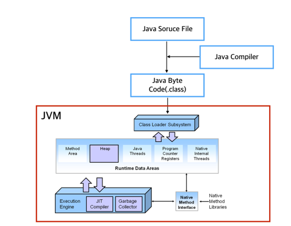
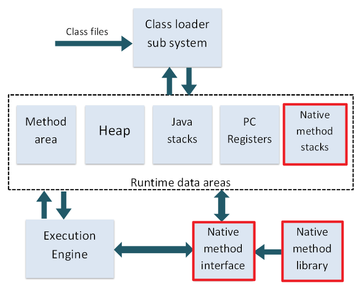
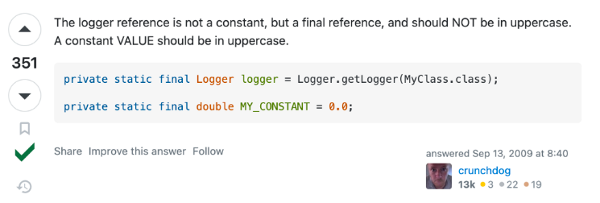

# JVM
## 1. JVM 이란?
Java Virtual Machine 의 약자로 
자바 프로그램이 실행되는 환경을 제공하는 가상 머신이다.

자바 바이트 코드를 해석하고 이를 실행하는 역할을 한다.


### - JDK vs JRE (JDK ⊃ JRE)
JRE(Java Runtime Environment) 는 컴파일된 자바 프로그램을 실행시킬 수 있는 자바 환경으로 JVM 이 이에 속한다. JVM 의 실행환경을 구현했다고 볼 수 있다.

JDK(Java Development Kit) 는 개발을 위해 필요한 도구들을 포함하며 자바 컴파일러가 이에 속한다. JDK 설치 시 JRE 도 설치된다.


### - .java vs .class
.java 파일은 자바 파일이 즉 소스 코드 파일이다. .class 파일 .java 파일을 컴파일하면 생기는 파일로 클래스 파일 혹은 자바 바이트 코드라 불린다.

자바 바이트 코드는 JVM 만 설치되어 있으면 어떤 운영체제든 상관없이 자바 언어로 작성된 코드를 실행할 수 있다.
JVM 에서는 클래스 로더를 통해 이 자바 바이트 코드를 로딩한다.

## 2. JVM 의 구조


## 3. JVM 구성요소
1. Class Loader
* 컴파일 된 자바의 클래스 파일(*.class)을 동적으로 로드하고, JVM의 메모리 영역인 Runtime Data Areas에 배치하는 작업을 수행한다.
* 클래스 로더는 ```프로그램의 런타임``` 중에 JVM 의 메소드 영역에 동적로딩을 수행한다.
    크게 (1) `로딩` (2) `링크` (3) `초기화`의 단계를 거쳐 자바 클래스를 메모리에 적재한다.
    * 로딩: 클래스 파일을 JVM 의 메모리 영역(Runtime Data Area의 ```Method Area```) 에 로드
    * 링크: 코드 내부의 레퍼런스를 연결하는 과정
      * 검증 vertify: .class 파일이 유효한지 검사
      * 준비 prepare: 클래스가 필요로 하는 메모리 할당, 클래스의 필드/메소드/인터페이스를 나타내는 데이터 구조 준비
      * 분석 resolve: 클래스의 상수 Pool 내 모든 심볼릭 레퍼런스를 다이렉트 레퍼런스로 변경한다.(이름에 의한 참조 -> 메모리 주소에 의한 참조)
    * 초기화: static 변수를 초기화하고 값을 할당하는 과정
> JLS(Java Language Specification)에 따르면 JVM에 클래스가 로딩되고 초기화될때는 순차적으로 동작함을 보장한다. 멀티 스레드 환경에서 여러개의 스레드가
클래스를 동시에 로딩하려고 해도 오직 한개의 클래스만 로딩된다. 즉 멀티 스레드 환경에서 스레드 세이프 하다는 의미이다. 이는 싱글톤과도 연결지을 수 있다.
* 클래스 로더 종류
  * BootStrap Class Loader - java.lang, java,util 기본적인 클래스:  JVM 시작 시 ```최초로``` 실행되는 클래스 로더 
    - Java Class 를 로드 할 수 있는 자바 자체의 클래스 로더와 최소한의 자바 클래스(java.lang.Object/Class/ClassLoader) 만을 로드하는 역할을 수행
      - Java 8 : jre/lib/rt.jar 및 기타 핵심 라이브러리와 같은 JDK의 내부 클래스를 로드한다.
      - Java 9 이후 :더 이상 /re.jar이 존재하지 않으며, /lib 내에 모듈화되어 포함됐다. 이제는 정확하게 ClassLoader 내 최상위 클래스들만 로드한다.
  * Extension Class Loader - java.net, java.sql 등 확장 기능을 위한 클래스: 확장 자바 클래스 파일들을 로드 
    - java.ext.dirs 환경 변수에 설정된 디렉토리의 클래스 파일을 로드하고, 이 값이 설정되어 있지 않은 경우 ${JAVA_HOME}/jre/lib/ext 에 있는 클래스 파일을 로드
  * System Class Loader(Java 8 버전까지는 Application Class Loader라고 불린다.)- 커스텀 클래스: 자바 프로그램 실행시 지정한 ClassPath에 있는 클래스 파일 혹은 jar 에 속한 클래스들을 로드
> 클래스 로더 동작 방식
> 
> JVM 의 메서드 영역에 클래스가 로드 되었는지 확인, 로드 되어있는 경우 해당 클래스 사용 
> -> 로드 안된 경우 시스템 클래스 로더(최하위 클래스 로더) 에 클래스 로드 요청 
> -> 확장 클래스 로더에 요청 위임 -> 부트 스트랩 클래스 로더에 요청 위임 
> -> 부트 스트랩 클래스 로더는 부트 스트랩 ClassPath(JDK / JRE / LIB) 에 해당 클래스 있는지 확인 후 존재 하지 않으면 확장 클래스 로더에 요청 넘김 
> -> 확장 클래스 로더는 확장 ClassPath(JDK / JRE / LIB / EXT)에  클래스 존재하지 않으면 시스템 클래스 로더에게 요청 넘김 
> -> 시스템 클래스 로더가 시스템 ClassPath에 해당 클래스가 있는지 확인 후 클래스가 존재하지 않는 경우 `ClassNotFoundException` 에러 발생

> 클래스 로더 3가지 원칙
> 
> 1. 위임원칙: 클래스 로더는 클래스 혹은 리소스를 찾기 위해 요청을 받았을 경우 상위 클래스 로더에게 책임을 위임하논 모델을 따른다
> 2. 가시범위 원칙: 하위 클래스 로더는 상위 클래스로더가 로딩한 클래스를 볼 수 있지만 반대는 불가하다. 이러한 원칙 덕분에 java.lang.Object 등 상위 클래스 로더에서 로드한 클래스도 하위 클래스
> 로더인 시스템 클래스 로더 등에서 사용할 수 있다.
> 3. 유일성원칙: 하위 클래스 로더가 상위 클래스 로더에서 로드한 클래스를 다시 로드 하지 않아야 한다.
2. Execution Engine
   * 인터프리터
   * JIT 컴파일러: 인터프리터의 느린 단점 보완 - 반복되는 코드 발견시 바이트 코드 전체 컴파일 실행
   * 가비지 컬렉터: 힙 영역에서 사용되지 않는 메모리 회수
> 자바는 왜 자바 컴파일러를 사용할까?
> 
> 자바는 WORA(Write Once, Run AnyWhere) 를 구현하기 위해 별도로 가상머신 JVM 을 기반으로 동작하도록 설계되었다.
그래서 자바는 자바의 바이트 코드를 실행하고자 하는 하드웨어에 맞게 JVM 을 동작시킴으로써 자바 실행 코드를 변경하지 않고 모든 종류의 하드웨어에서 동작하게 하였다.
자바 원시코드는 CPU가 인식하지 못하므로 기계어로 컴파일해줘야 한다. 자바는 JVM 이라는 가상 머신을 먼저 거쳐 OS 에 도달하기 때문에, OS 가 인식할 수 있는 기계어로 바로 컴파일 되는 
것이 아니라 JVM 이 인식할 수 있는 자바 바이트 코드로 변환된다. 이 때 자바 컴파일러가 .java 파일을 .class 파일로 변환한다.

> JVM의 실행 엔진은 왜 인터프리터를 사용할까?
> 
> 인터프리터는 플랫폼에 종속되지 않는다. 자바 인터프리터는 자바 컴파일러를 통해 생성된 바이트 코드를 한줄 씩 읽어 기계어로 번역하고 실행한다.
> WORA 를 구현하고자 한 것이다. 인터프리터가 아닌 컴파일러를 통해 바이트 코드의 목적파일을 생성한다면 기계에 종속되는 파일이기 때문이다.
> 하지만, 인터프리터는 컴파일러에 비해 너무 느리기때문에 이를 해결하고자 JVM 은 부분적으로 JIT 컴파일러를 사용해 바이트 코드를 컴파일 해 사용한다.

> JIT 컴파일러 동작원리
>
> JIT 컴파일러는 실행 시점에 인터프리터 방식으로 기계어 코드를 생성할 때 자주 사용되는 메소드의 경우 컴파일하고 기계어를 캐싱한다. 즉,
> 반복되는 코드들을 컴파일하여 캐싱해둠으로써 인터프리터는 반복되는 코드를 읽지 않고 컴파일된 코드를 그대로 사용한다.

> JIT 컴파일러 이점
> 
> 일반적인 인터프러터 언어는 바이트코드나 소스코드를 최적화 과정이 없이 번역하기 때문에 성능이 낮다. 
> 반면 정적으로 컴파일하는 언어는 실행 전에 무조건 컴파일을 해야 하기 때문에 다양한 플랫폼에 맞게 컴파일을 하려면 시간이 오래 걸린다. 
> JIT 컴파일러는 실행 과정에서 컴파일을 할 수 있기 위해 만들어졌다. 
> JIT 컴파일러는 정적 컴파일러만큼 빠르면서 인터프러터 언어의 빠른 응답속도를 추구하기 위해 사용한다.
3. Runtime Data Area

    JVM 이 프로그램 수행위해 OS로부터 할당 받는 메모리영역이다. 
    * PC 레지스터
      * JVM의 명령어 주소를 저장한다.
    * JVM Stack
      * 각 스레드 별로 메서드 실행 시, 해당 메서드들의 실행을 위한 지역변수, 매개변수의 할당 연산을 위한 영역 - 스택프레임 구조를 지님
    * Native Method Stack
      * JNI를 통해 실행된 Native Method 들이 사용하는 스택
    * Heap
      * 인스턴스와 배열이 동적으로 생성되는 공간
      * 가비지 컬렉션의 대상이 되는 영역
      * 모든 스레드가 공유하기에 동기화 문제 발생
    >자바 애플리케이션은 heap 영역과 off-heap 두 공간을 이용해 동작하는데 애플리케이션을 배포할 때 메모리 몇 GB를 할당해야하는지 결정하기 위해서,
    단순히 Xmx(자바 힙 메모리 최대치 결정하는 자바 옵션) 만 고려하면 OOME 에 빠지기 쉽다고 한다. 실제로는 Xmx 에 metaspace 값을 더하고,
    추가로 프로그램에서 NIO 를 사용해 Native Memory 를 직접할당받는 로직을 고려해 Heap + Native Memory 사용총량으로 할당해야한다고 한다.
    최근에 Netty, Spark, Cassandra, Ignite 등의 애플리케이션이 off-heap 을 이용해 성능향상을 하고 있다. 
    -> 대규모 데이터를 다루는 분산환경에서 off-heap 메모리는 중요하다!

    * Method Area 
      * 클래스 로더가 적재한 클래스 또는 인터페이스에 대한 메타 데이터 정보가 저장된다.
      * Heap 의 PermGen 이라는 영역에 속했으나 Java 8 이후로는 Metaspace라는 OS가 관리하는 영역
      * 모든 스레드가 공유
4. JNI - 네이티브 메서드 인터페이스
   * 다른 언어로 만든 Application과 자바가 상호 작용할 수 있는 인터페이스를 제공
   * JNI는 JVM이 Native Method를 적재하고 수행할수 있도록 한다.
     
5. 네이티브 메서드 라이브러리
    * 네이티브 코드(C/C++)로 작성된 라이브러리
    * 헤더가 필요하면 JNI는 이 라이브러리를 로딩해 실행한다.
   
   


## 4. JVM 동작방식
1. 자바 프로그램 실행시 JVM은 OS 로 부터 메모리를 할당받는다
2. 자바 컴파일러(javac.exe : JDK 에 포함되어 있음) 가 자바 소스코드를 자바 바이트 코드로 컴파일한다.
3. 클래스로드는 동적로딩을 위해 필요한 클래스들을 로딩 및 링크하여 런타임 데이터 영역에 올린다.
4. 런타임 데이터 영역에 로딩된 바이트 코드는 Execution Engine 을 통해 해석된다. 
5. 그 과정에서 Execution Engine 에 의해 가비지 컬렉터의 작동과 스레드의 동기화가 이루어진다.

---
### 동적 클래스 로딩
1. 로드 타임 동적 로딩
   하나의 클래스를 로딩하는 과정에서 동적으로 클래스를 로딩하는 것
2. 런타임 동적 로딩
   클래스를 로딩할 떄가 아닌 코드를 실행하는 순간에 클래스를 로딩하는 것

### 클래스 로더
" static final 로 선언된 상수를 사용할 경우에는 클래스 로더가 해당 클래스를 로딩하지 않는다."

클래스 멤버를 사용하기 위해선, 해당 클래스의 메모리를 JVM 에 적재해야한다. 이를 클래스 로더가 해주는데, 클래스 로더는 아래 3가지로 작동한다.
1. 컴파일 시 .class 라는 바이트 코드로 변환된다.
2. ```런타임``` 때 클래스의 멤버를 사용해야 한다면, 클래스 로더는 해당 클래스의 바이트 코드를 찾는다.
3. 각종 검증과 초기화 단계를 거쳐 JVM 의 런타임 데이터 영역에 바이트 코드를 적재한다.

여기서 잠깐~! 바이트 코드가 프로그램 실행 초기에 모두 적재되는 것이 아닌, 런타임 때 해당 클래스가 필요하면 동적으로 적재된다는 것이다.
그런데 위의 말은 좀 이상하다. static final 도 어떤 특정 클래스 내부에 작성되어 사용하려면 해당 클래스를 로딩해야하는 것이 아닌가라는 의문이 들기 때문이다.

그 이유는 클래스가 로드 되는 시점과 static final 의 컴파일 타임 상수와 관련이 있다.

< 클래스가 로드 되는 시점 >
1. 클래스의 인스턴스가 생성될 때
    ```java
        public static void main(String[] args) {
            Single singleInstance = new Single();  // Single 클래스의 생성자 호출
            System.out.println(singleInstance);
        }
    ```

2. 클래스의 정적 변수가 사용될 때(static final 제외)
    ```java
    class Main {
        public static void main(String[] args) {
            System.out.println(Single.a);  // Single 클래스의 정적 변수 a 사용
        }
    }
    
    class Single {
        public static int a = 42;  // 정적 변수 a 초기화
    }
    ```
3. 클래스의 정적 메소드가 호출 될 경우
    ```java
    class Main {
        public static void main(String[] args) {
            Single.getInstance();  // Single 클래스의 정적 메소드 호출
        }
    }
    
    class Single {
        public static void getInstance() {
            System.out.println("정적 메소드 getInstance()가 호출되었습니다.");
        }
    }
    ```
클래스 로딩 및 초기화 과정이 스레드 세이프 함을 이용해 싱글톤 인스턴스를 만들 수 있다.
(1) 여러개의 스레드 동시 생성  - 클래스 로딩 및 초기화는 10개의 스레드가 동시에 시도해도 오직 단 한번만 수행된다 (2)
```Java
public static Single getInstance() {
    // 여러 스레드가 동시에 if문을 통과하는 경우
    if(instance == null) {
        // 여러개의 인스턴스가 만들어질 수 있음
        instance = new Single();
    }
    return instance;
}
```
(2) LazyHolder 방법으로 싱글톤 인스턴스 생성 가능
1. 스레드 세이프 보장
2. 필요할 때 인스턴스 생성 - 정적 메소드 호출 시 ```SingleTon.getInstance()```
```Java
// 싱글톤 클래스
class SingleTon {
    // private 생성자 new 를 통한 인스턴스 생성 방지
    private SingleTon() {
        System.out.println("싱글톤 인스턴스 생성");
    }

    // 정적 메서드를 통해 내부 클래스 로딩
    public static SingleTon getInstance() {
        return LazyHolder.INSTANCE;
    }

    // 내부 클래스가 로딩될때 초기화 수행 - 싱글톤 인스턴스 생성
    private static class LazyHolder {
        private static final SingleTon INSTANCE = new SingleTon();
    }
}
```
< static final >
static final이라 하더라도, 런타임 상수 혹은 불변 참조(final reference)라면 클래스 로딩
static final 중 컴파일 타임 상수만 클래스 로딩 하지 않는다.

< 불변 참조 >

static final 이지만 객체의 상태는 변할 수 있기 때문에 상수가 아니라 불변 참조라고 한다.



---
참고 링크 : https://velog.io/@skyepodium/%ED%81%B4%EB%9E%98%EC%8A%A4%EB%8A%94-%EC%96%B8%EC%A0%9C-%EB%A1%9C%EB%94%A9%EB%90%98%EA%B3%A0-%EC%B4%88%EA%B8%B0%ED%99%94%EB%90%98%EB%8A%94%EA%B0%80#4-%EC%98%A4%EC%A7%81-%ED%95%9C%EB%B2%88%EB%A7%8C-%ED%81%B4%EB%9E%98%EC%8A%A4%EA%B0%80-%EB%A1%9C%EB%94%A9%EB%90%A8%EC%9D%84-%EB%B3%B4%EC%9E%A5
