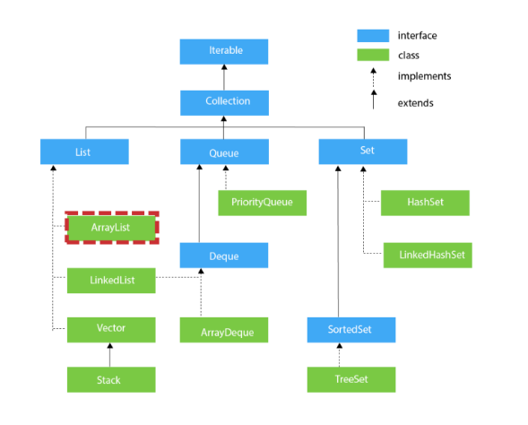

# Collection Framework

---
## Collection Framework 란 무엇인가요?
데이터 그룹을 다루기 위한 표준화된 방법을 제공하는 인터페이스와 클래스들의 집합이다.




#### Collection 인터페이스 - List
* 자료의 순서를 보장한다.
* 내부 자료의 중복을 허용한다.
* 구현한 클래스로는 Arraylist,Vector, LinkedList 가 있다.
---
#### Collection 인터페이스 - Set
* 자료의 순서를 보장하지 않는다. (LinkedHashSet 제외)
* 내부 자료의 중복을 허용하지 않는다.
* 구현한 클래스로는 HashSet, TreeSet, LinkedHashSet
---
#### Map Interface
   * List, Set과 같이 하나의 자료를 저장하는 것이 아니라, Key-Value 의 묶음 ( Entry 인터페이스 )으로 자료를 저장한다.
  * 구현한 클래스로는 HashMap, HashTable, LinkedHashMap 이 있다.
---

### HashMap vs HashTable
HashTable은 Thread-Safe 하다.

### 라이브러리 vs 프레임워크
* 라이브러리: 개발자가 필요한 기능을 필요한 시점에 선택적으로 사용할 수 있는 도구 
  * 제어의 흐름이 개발자에게 있음: 개발자는 라이브러리를 사용하는 방식을 결정 및 통제
  * 통합성이 낮음: 보다 작은 범위의 기능 제공, 개발자가 필요한 기능 선택적으로 사용
  * ex. 파이썬 수학 연산 라이브러리 - NumPy
* 프레임워크: 개발을 위한 틀이 제공됨
  * 제어의 역전: 프레임워크는 애플리케이션의 흐름을 제어하는 것이 개발자가 아닌 프레임워크 자체이다. 개발자는 프레임워크가 제공하는 틀 안에서 코드를 작성하며 프레임워크는 
개발자가 작성한 코드를 호출한다.
  * 통합성이 높음: 프레임워크는 특정 작업이나 목적을 위한 전체적인 구조를 제공한다. ORM, MVC 등의 디자인 패턴을 내장한다.
  * ex. 파이썬 웹 프레임워크 - 장고, 자바 엔터프라이즈 프레임워크 - 스프링

### ArrayList vs linkedlist

### ArrayList 
* 데이터의 개수가 예상이 가능한 경우
* 삽입, 삭제가 빈번하지 않은 경우
* 데이터의 접근이 빈번한 경우

### LinkedList
* 데이터의 삽입, 삭제가 빈번한 경우 
* 맨 앞, 맨 뒤 노드에 대한 것이 아니면 해당 위치로 접근해야하고, 해당 위치를
모를 경우 접근하는데도 추가적인 시간이 소요되므로 데이터의 개수가 많지 않은 경우에 해당 자료구조가 권장된다.
* 데이터의 접근이 빈번하지 않은 경우


### ArrayList vs Array 
ArrayList 는 크기가 넘는 데이터 추가는 내부적으로 큰 배열을 생성해 기존 배열의 내용을 복사한다. 즉 크기가 가변적이기에 별도로 배열을 생성하고 복사하는 리사이징과정에서 성능이 느려질 수 있다.
Array 크기는 고정적이다.

### Java의 Vector와 Stack
자바의 ```Stack``` 의 경우 멀티스레드 문제와 동기화 문제가 있는 ```Vector``` 클래스를 상속 받기 때문에 ```Vector``` 의 단점을 그대로 물려받아 사용하지 않는 것이 권장된다.
