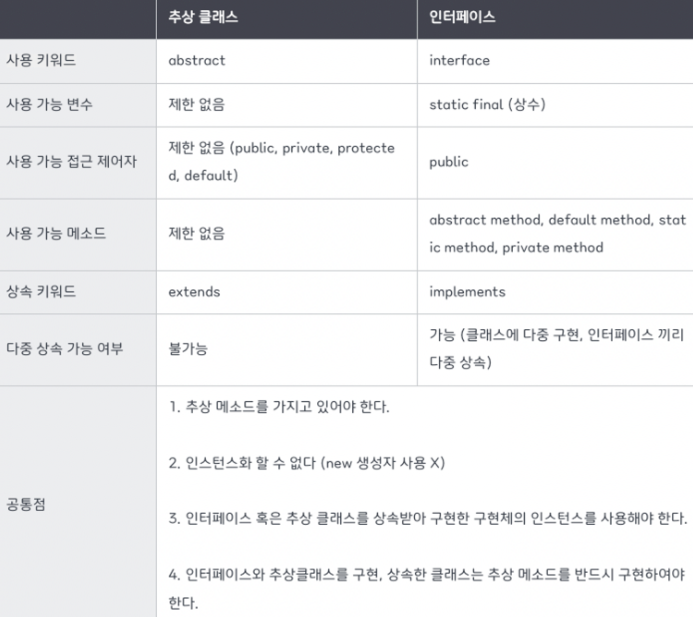

# 인터페이스와 추상클래스의 차이점에 대해 설명해주세요.
<답변의 키포인트>

인터페이스와 추상클래스 모두 추상 메소드를 통해 상속/구현을 통한 메소드 강제 구현 규칙을 가지는 추상화 클래스이다.

추상클래스는 abstract 키워드와 extends 로 다형성을 달성하며, 단일상속만 가능하다. 또한 추상클래스를 상속하는 집합간에 연관관계가 존재한다.

반면 인터페이스는 interface 키워드와 implements 를 사용해 다형성을 달성하며, 구현을 통해 다중상속이 가능하다.

인터페이스의 경우 static final 변수와 public 접근제어자, abstract/default/static/private 메소드만 사용가능하지만 이에 반해 추상클래스는 이러한 제한이 없다.

> 또한 인터페이스의 추상메소드의 경우 메소드 구현부 즉 body 가 비어있어 다중 상속에서 부모 클래스에 같은 시그니처 메소드가 있을 시 어떤 메소드를 상속받아야하는지 판별할 수 없는 다이아몬드 문제가 발생하지 않는다.

> 인터페이스의 디폴트 메소드에서의 다이아몬드 문제는 컴파일 타임안에 해결된다.
---

<추상클래스를 사용하는 경우>

- 굉장히 밀접하게 관련된 클래스들끼리 코드를 공유해야 할 때
- 추상클래스의 하위 구현체 클래스들이 공통된 필드나 메서드를 많이 공유하고, 접근제한자가 public 이 아닌경우
- non-static 또는 non-final 필드로 객체의 상태를 바꿔야 하는 경우

<인터페이스를 사용하는 경우>

- 관련이 없는 클래스들끼리 관계를 맺어줄 때
- 특정 데이터 타입의 동작을 지정하려고 하지만 해당 동작을 누가 구현하는지 중요하지 않을 경우
- 다중 상속이 필요한 경우

<추상클래스와 인터페이스>

