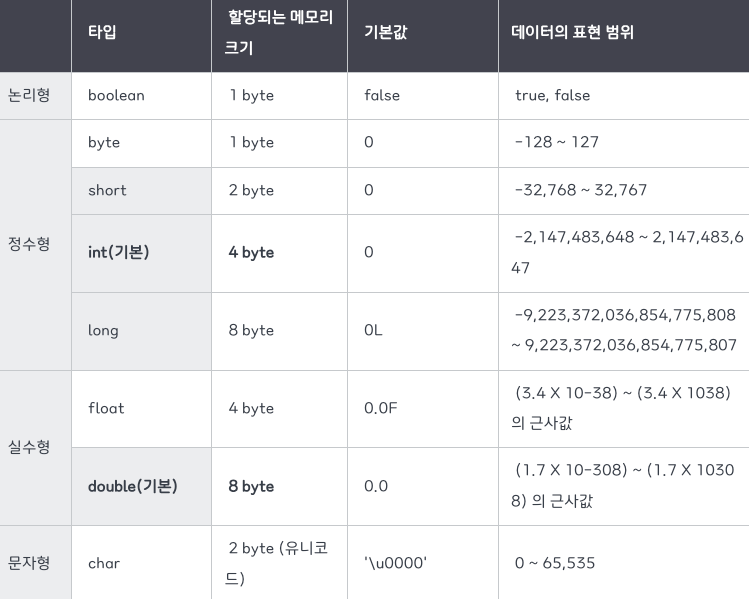

## 자바의 원시타입들은 무엇이 있으며 각각 몇 바이트를 차지하나요
### 원시타입
자바의 원시타입은 정수, 실수, 문자, 논리 리터럴 등 실제 데이터를 저장하는 타입이다.

int a =1 이 선언되었다면 정수 값이 할당될 수 있는 a 라는 이름의 메모리 공간이 JVM 의 스택 영역에 생성되고 10이 들어간다. 즉 원시타입은 메모리 공간에 실제 데이터 값이 저장되어있다.

위에서 char 의 경우 한국어 등의 경우 2바이트가 필요하기에 char 는 2바이트를 이용한다.
음수의 범위 없이 0부터 65535의 범위를 지정한다. 자바에서 유일하게 제공되는 unsigned 이다.
> 바이트 VS 워드
> 
> 컴퓨터의 기본 저장 단위(컴퓨터가 인식할 수 있는 기본 단위) 는 1바이트 이다. 바이트는 문자 표현 최소단위 이다. 예를들어 영어는 1바이트로 표현되고 한글은 2바이트가 필요하다.
> 
> 워드는 CPU가 한번에 처리할 수 있는 명령 단위이다.

### 참조타입
참조타입은 원시타입을 제외한 타입으로 객체의 주소를 저장하는 타입이다. 문자열, 배열, 열거형, 상수, 클래스, 인터페이스 등이 있다. 참조타입변수는 실제 객체의 주소를 JVM 의 스택영역에 저장한다. 그리고 실제 객체는 JVM 의 힙영역에 저장된다. 그 후 객체를 사용할 때마다 참조변수에 저장된 객체의 주소를 불러와 사용하게 된다.

---
### 성능

원시타입은 스택 영역에 존재하고, 참조타입은 주소 즉 참조값만 스택영역에 실제 객체는 힙영역에 존재하므로 참조타입은 최소 2번 메모리 접근이 요구되며 일부 타입은 값을 필요로 할 때 언박싱 과정을 거쳐야하므로 원시타입과 비교해서 접근 속도가 느리다.

### null

원시타입은 null 을 담을 수 없고, 참조타입은 담을 수 있다. 원시타입의 경우 값이 없으면 디폴트 값을 반환한다.

### 제네릭

제네릭의 경우 참조타입을 사용하는데 이는 이전 버전의 JVM 과의 호환성 때문이다.

제네릭이 지원된 2004년 이전에는 여러 타입을 지원하기 위해 object 로 선언했기 때문에 호환성때문이라도 원시타입을 불가능했다.
