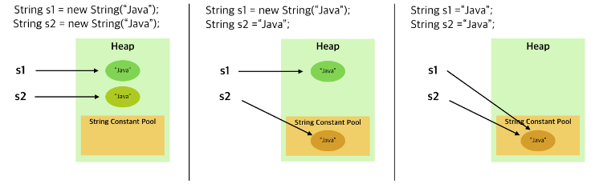
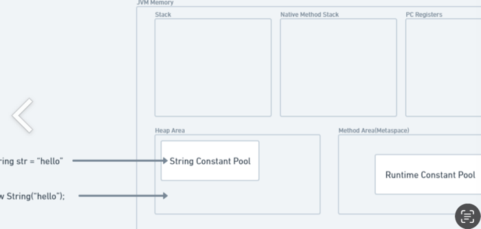

# 동일성(identity)와 동등성(equality)에 대해 설명해주세요. 

동일성은 객체의 주소를 비교하는 것이고, 동등성은 객체의 같음을 비교하는 것입니다.

기본적으로 자바에서는 Object 클래스에 정의된 equals() 메소드가 동일성 비교를 한다. 따라서, 개발자는 원한다면 equals() 메소드를 오버라이딩해서 동등성의 판단 기준을 정의해주면 된다.

### 동일성(Identity)
(1) 동일한 객체는 같은 해시 코드 값을 지닌다.

(2) 해시 코드 값: 모든 객체가 가지고 있는 고유한 값으로 보통 객체가 위치한 메모리 주소에 특정함수를 적용한 결과 값으로 나타낸다.

(3) 해시 코드 값은 Object 클래스의 hashCode()로 얻을 수 있다. 

(4) == 연산자로 비교 시 true 라면 동일성이 같은 객체이다.

### 동등성(Equality)
(1) 두 객체의 동등성을 비교했을 때 같다는 것은 객체가 가지고 있는 값이 같다라는 뜻 -> 즉 객체의 멤버 필드가 가리키는 값들이 서로 같다는 것

(2) 객체가 논리적으로 같은지를 비교하는 것

(3) 동등성이 같은 객체는 동일성이 같을 수도 다를 수도 있다.

(4) 자바에서 동등성을 비교할 때 주로 Object 클래스의 equals() 메소드를 오버라이딩한다.


일반적으로 equals() 은 아래와 같이 작성된다. 이를 오버라이딩 하지 않고 사용한다면 동일성을 비교하게된다.
따라서 equals() 메소드의 내부를 this와 obj의 멤버 필드의 값이 같은지를 비교하도록 오버라이딩 하면 동등성 비교가 가능하다.

```java
public boolean equals(Object obj) {
	return (this == obj);
}
```


> hashCode()와 equals()의 관계
> equals() 메소드를 동등성을 비교하기 위해 오버라이딩 했다면, hashCode() 메소드도 동등성을 기준으로 생성하게 해야한다.  Collection(HashMap, HashSet, HashTable)
> 은 객체가 논리적으로 같은지 비교 시 hashCode() 를 이용하기 때문이다.


만약, eqauls() 만 오버라이딩하고 hashCode() 는 오버라이딩을 하지 않는다면
아래와 같이 hashCode() 를 사용하는 컬렉션에서 원치 않는 결과값이 도출된다.

```java
  @Test
    void carContainsTest() {
        Car genesis1 = new Car("제네시스");
        Car genesis2 = new Car("제네시스");

        Set<Car> cars = new HashSet<>();
        cars.add(genesis1);
        cars.add(genesis2);

        assertThat(cars.size()).isEqualTo(1);
    }
    

//Expected : 1
//But was  : 2
//Expected : 1
//Actual   : 2
```

결론: equals() 의 결과가 true 인 두 객체의 해시코드는 반드시 같아야한다

### String
* 리터럴("") 로 선언 시 : Heap 영역 내부에 **String Constant Pool** 영역에 저장된다.
> 리터럴로 선언할 경우 내부적으로 intern() 메소드를 호출한다.
이 메소드는 String Constant Pool 에 같은 값을 가진 String 객체가 있다면 해당 주소 값을 반환하는 행위를 수행하는 메소드이다.
>
>new 연산자로 생성한 String 객체에 intern() 함수 호출 시 리터럴로 생성했을 때와 같은 행위가 수행될 것이다

* new 연산자로 선언 시 : Heap 영역에 객체가 생성된다.

####  < 리터럴 vs 객체 비교 1 >
```java
String s1 = "java"; // String constant pool에 저장
String s2 = "java"; // String constant pool에서 재사용
String s3 = new ("java"); // 별도의 Heap 메모리에 저장

System.out.println(s1 == s2);	// true (같은 객체를 재사용하기 때문에)
System.out.println(s1 == s3);	// false
System.out.println(s1.equals(s3));	// true
```

####  < 리터럴 vs 객체 비교 2 >



####  < 리터럴 vs 객체 비교 3 >
Java7 이후부터 String Constant Pool은 JVM에 의해 Garbage Colleted되는 Heap 메모리 영역에 배치되었다.
참조되지 않은 String은 GC에 의해 String Constant Pool에서 제거되어 메모리가 해제되기 때문에 OutOfMemory 오류의 위험이 감소한다.

#### < 결론>
* 리터럴이든 객체든 두 객체의 동등성을 비교하려면 equals() 메소드를 사용해야한다.

* 재사용성 때문에, 동일성 때문에, 메모리 공간을 덜 사용하는 리터럴을 사용하자


---
### String Constant Pool vs Runtime Constant Pool
Class file 이 런타임 시 JVM 의 메타 스페이스 내에 Runtime Constant Pool 영역으로 저장된다.
주로 클래스와 관련된 메타 데이터를 저장하고, 클래스 구조, 필드, 메서드와 같은 데이터를 저장한다.


Class file(Constant Pool) : 컴파일시 클래스파일 내부에 존재하는 영역으로, 클래스로더에 의해 JVM에 로드될 때 메모리에 로드된다. 주로 클래스의 구성요소(상수, 문자열, 클래스/인터페이스 참조) 데이터를 저장한다.
