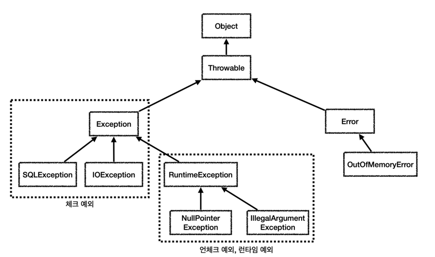
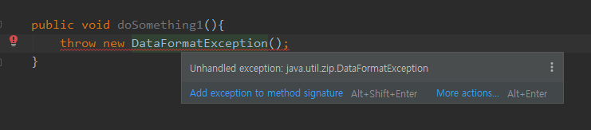

# Checked Exception과 Unchecked Exception에 대해 설명해주세요. 스프링 트랜잭션 추상화에서 rollback 대상은 무엇일까요?
컴파일러가 에러처리를 확인하지 않는 RuntimeException 클래스들은 unchecked 예외라고 부르고 
예외처리를 확인하는 Exception 클래스들은 checked 예외이다.



### Checked exception
- Checked Exception 은 자바 컴파일러가 처리해야하는 예외이다.
- throws 키워드를 사용해서 상위 클래스로 예외를 던지거나, try-catch 형태로 예외를 직접 처리해야 한다는 의미
- ```Exception 클래스를 상속```하는 클래스들 - IOException, ServletException, SQLException 등
- 클라이언트가 예외를 직접 처리하고 예외를 복구할 것으로 예측할 수 있을 때 사용하기 적합한 Exception 타입



예외를 처리하지 않으면 위처럼 컴파일러가 에러를 보여준다.

- checkedException 은 복구 불가능한 예외라는 점과 의존관계에 대한 문제가 존재한다. 서비스/ 컨트롤러에서 특정 예외에 의존하게 된다는 점이다.
### Unchecked exception / Runtime exception
- RuntimeException 과 그 하위 예외들
- UnCheckedException 은 자바 컴파일러가 처리할 필요가 없는 예외이다. 컴파일러가 신경 쓰지 않기 때문에 별도의 예외처리를 해주지 않아도 된다.
- NullPointerException, IllegalArgumentException, and SecurityException.

- 보통 비지니스 로직에서는 CheckedException 을 잡아 custom UnCheckedException 으로 바꿔주고, 서블릿 필터, 스프링 인터셉터, 스프링 ControllerAdvice
를 사용해 공통으로 예외를 해결한다.

> 체크 예외의 경우 예외를 반드시 던져야 하는 등의 단점이 존재하기에 최근 라이브러리들은 대부분 런타임 예외를 기본으로 한다.
> 런타임 예외의 경우 필요하면 잡을 수 있고, 그렇지 않으면 자연스럽게 던지도록 두고 예외를 처리하는 부분을 공통으로 앞에 만들어 처리하면 된다.

### Errors
- 라이브러리 비 호환성, 무한 재귀, 메모리 누수와 같은 심각하고 일반적으로 복구할 수 없는 상태를 나타낸다.
- OutOfMemoryError, StackOverflowError 


### throws 키워드
throws 는 메소드 선언부에서 사용되며 해당 메서드에서 발생할 수 있는 예외를 명시적으로 선언한다.
이 메소드를 호출하는 쪽에서 예외를 명시적으로 처리해야한다.
> "throw"는 예외를 발생시키는 데 사용되고, "throws"는 메서드에서 발생할 수 있는 예외를 선언하는 데 사용, 호출하는 쪽에서 예외 별도 처리 필요

### try-catch-finally
try 블록 안에서 예외가 발생할 수 있는 코드를 감싸고, 예외가 발생하면 catch 블록이 실행되어 예외를 처리한다.
```java
public class Example {
    public static void main(String[] args) {
        try {
            // 예외가 발생할 수 있는 코드
            int result = divide(10, 0);
            System.out.println("Result: " + result);
        } catch (ArithmeticException e) {
            // 예외 처리
            System.out.println("Cannot divide by zero.");
        } finally {
            // 항상 실행되는 코드
            System.out.println("Finally block: This will be executed no matter what.");
        }
    }

    public static int divide(int numerator, int denominator) {
        return numerator / denominator;
    }
}

```

### 스프링 트랜잭션 추상화에서 rollback 의 대상
```기본적으로``` CheckedException 은 예외가 발생하면 트랜잭션 roll-back 하지 않고 예외를 던져준다.


하지만
Unchecked Exception 은 예외 발생 시 트랜잭션 roll-back 한다는 점에서 큰 차이가 있다.
> 자바에서의 트랜젝션에서 위를 논하면 틀리다. 스프링에서 기본적으로 롤백 대상 예외가 UnCheckedException 인 것이다. - 백기선님 유튭


---

https://sup2is.github.io/2021/03/04/java-exceptions-and-spring-transactional.html
https://www.baeldung.com/java-exceptions#handling-exceptions
