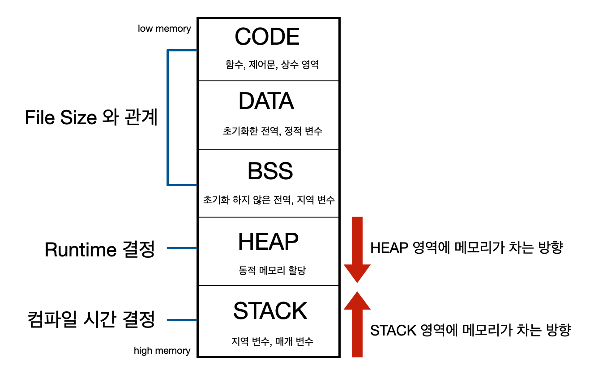

## 정적(static)이란 무엇인가요?

### static의 사전적 의미
```text
❗️정적인, 움직이지 않는다.
```
메모리의 입장에서 고정되기에 붙은 의미지만, 실제 사용시에는 모든 객체가 `공유`한다는 의미를 가진다.
즉, <strong>메모리에 한 번 할당되어 프로그램이 종료될 때 해제되는 것</strong> = GC의 관여가 없다.

---

### 메모리 공간 구조


1. CODE 영역<br>
실행할 프로그램의 코드가 저장되는 영역으로 CPU는 Code에 저장된 명령어를 하나씩 읽어 실행한다.
2. DATA 영역<br>
`전역변수`와 `정적변수(static)`가 저장되는 영역으로 프로그램 시작과 함께 할당되며 프로그램 종료 시 소멸한다.
3. HEAP 영역<br>
함수의 호출과 관계된 영역으로, `지역변수`와 `매개변수`가 저장되는 영역이다. 함수의 호출과 함께 할당되며 함수의 호출이 완료되면 소멸한다.
4. STACK 영역<br>
사용자가 직접 관리할 수 있는 메모리 영역이다.
사용자에 의해 메모리공간이 할당되고 해제된다.
일반적으로 class는 static 영역에 생성되고, new 연산을 통해 생성된 객체는 Heap영역에 생성된다.

### 예제
```java
class NamePrint{
    static void print() {
        System.out.println("name1");
    }

    void print2() {
        System.out.println("name2");
    }
}

public class Static_ex {

    public static void main(String[] args) {
        NamePrint.print(); //인스턴스를 생성하지 않아도 호출이 가능

        NamePrint namePrint = new NamePrint(); //인스턴스 생성
        NamePrint.print2(); //인스턴스를 생성하여야만 호출이 가능
    }
}
```

---

### 관련 의문점
왜 스태틱 사용을 지양해야 하는가?

관련한 stackoverflow link:
https://stackoverflow.com/questions/7026507/why-are-static-variables-considered-evil <br>

질문과 가장 많은 추천수를 받은 답변에 대한 번역 및 요약입니다.

```text
그동안 자바로 개발할 때, static 키워드를 꽤 많이 사용하는 습관을 보유하고 있습니다.
그러나, 사수인 시니어 개발자가 static을 줄이라고 말하였습니다.
저는, static을 사용하는 것이 보다 편하고 효율적이라고 생각합니다.
어떤 클래스 내에서 만번의 함수 호출을 하게 될 경우, 함수를 static하게 만들어서 인스턴스 메모리 영역을
어지럽히지 않는 것이 낫지 않을까요?
특히나 static 변수의 코드는 상호의존성을 줄여준다고 생각합니다.
static은 자바 뿐만 아니라 많은 언어에서 유용하게 사용되나, 유독 자바에서는 지양하는 이유가 궁금합니다.
```
답변 1
```text
static 변수는 global한 state를 상징합니다.
global state는 추론과 테스트가 매우 까다롭습니다.
가령 코드에서 static을 사용한다고 가정하였을 때, 이 변수의 상태는 코드 여러부분에서 사용될 수 있기 때문에
영향을 많이 받게 되고 따라서 변화를 추적하기 어려워집니다.
반면에 이를 객체화하여 인스턴스로 생성하게 된다면 테스트 중에 해당 변수가 어떤 상태를 가지고 있는지 추적하기 쉬워집니다.
```
답변 2
```text
1. static은 객제지향적이지 않습니다. : 각 객체의 데이터들이 캡슐화되어야 한다는 객체지향 프로그래밍의 원칙을 벗어납니다.
2. 객체의 라이프타임: 추가로, static 변수는 프로그램이 실행되고 있는 내내 살아있게 됩니다.
즉, 그 클래스를 이용한 작업을 끝내더라도 static 변수가 점유하고 있는 메모리는 garbage collector에 의해서 회수되지 않게 됩니다.
반대로, 프로그래머가 그 변수를 인스턴스화 해서 main() 함수 내에서 하나의 인스턴스로 생성하게 되면,
그리고 그 인스턴스에게 만번의 함수 호출을 시키게 되면 그 만번의 함수 호출이 끝난 후 인스턴스는 소멸됩니다.
따라서 메모리를 훨씬 절약할 수 있게 됩니다.
```