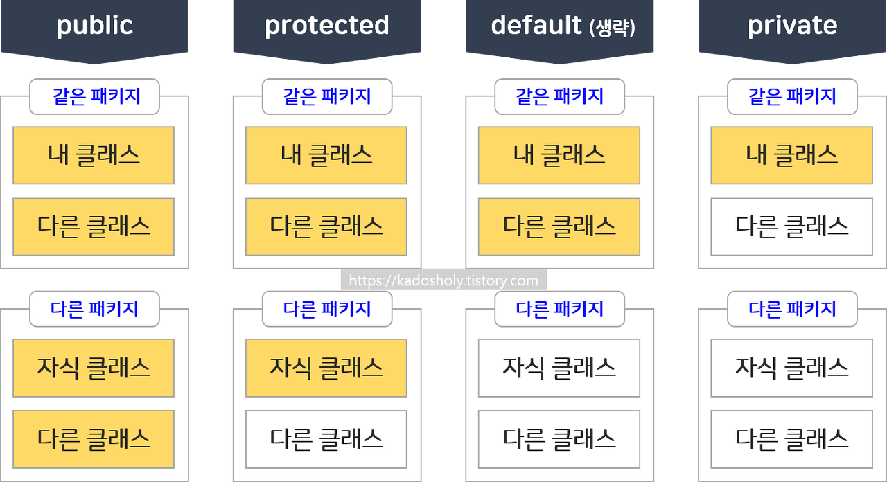

## 접근 제어자의 종류와 이에 대해 설명해주세요
> 접근 제어자(access modifier) 란?
> 
> 객체지향에 존재하는 개념 정보 은닉(data hiding)을 위한 기능입니다.
> 접근 제어자를 사용해 멤버의 접근을 제어하고 이를 통해 정보 은닉을 구체화합니다.

### 종류
- default
- private
- protected
- public

---
### 종류에 따른 접근 가능 범위


### default
default 는 접근 지정자가 없으면 생략이 가능하며, 동일 패키지 내 클래스에서만 접근이 가능합니다.

```java
package defaultPackage;

public class DefaultExample {
    String str = "default String";
}
```
```java
package defaultPackage;

public class Main {
    String str2 = "default String2";
    public static void main(String[] args) {
        DefaultExample defaultExample = new DefaultExample();
        System.out.println(str2);
        System.out.println(defaultExample.str);
    }
}
```

### private
private 은 "비공개"를 의미하며, 같은 클래스 내 멤버들만 접근이 가능합니다.

```java
public class PrivateExample {
    private String str = "private String";
    
    private String getStr() {
        return this.str;
    }
}
```

### protected
protected 는 같은 패키지 안 모든 클래스와 (default) 다른 패키지의 자식 클래스에서 접근이 가능합니다.

```java
package protectedPackage;

public class ProtectedExample {
    protected String str = "protected String";
}
```

```java
package protectedPackage.child;

import protectedPackage.ProtectedExample;

public class Main extends ProtectedExample {
    public static void main(String[] args) {
        ProtectedExample protectedExample = new ProtectedExample();
        System.out.println(protectedExample.str);
    }
}
```

### public
public 은'공개'를 의미하며 패키지와 관계 없이 모든 클래스에서 접근이 가능합니다.

```java
public class PublicExample {
    public String str = "public String";

    public String getStr() {
        return this.str;
    }
}
```
---
### 추후 정리할 꼬리 질문
데이터 무결성을 지켜야 하는 이유?