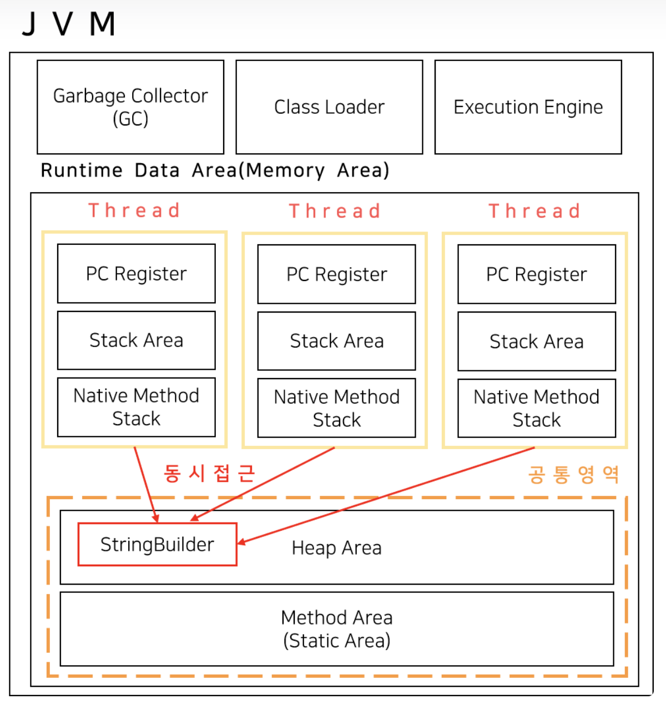

## String, StringBuilder, StringBuffer의 차이점

> 3가지의 차이점을 알아보는 이유는, 3가지 모두 문자열을 다루는 클래스라는 공통점이 존재합니다.

### String 이란?
Java에서 문자열을 다루는 기본적인 자료형.<br>
기본적으로 String은 불변(immutable) 객체입니다.
String 객체의 내부는 다음과 같습니다.
`final` 키워드가 존재합니다.
```java
public final class String implements java.io.Serializable, Comparable {
	private final byte[] value;
}
```
> jdk8까지는 byte[]가 아닌 char[] 배열로 구성되어 있었으나, 이후 메모리 효율을 높였습니다.

문자열에서 많이 사용하는 trim(), toUpperCase()와 같은 함수들은, 선언된 문자열을
변경하는 것이 아닌, 새로 문자열을 만들어 return 합니다.

### StringBuilder, StringBuffer
문자열을 다룬다는 점에서는 String과 동일하지만, String과 다르게 가변(mutable)적입니다.
따라서 값이 변경될 때마다 새롭게 객체를 만드는 String 보다 훨씬 빠르기 때문에,
문자열의 추가, 수정, 삭제가 자주 발생할 경우 사용합니다.
> 사용 문법은 StringBuilder, StringBuffer 둘은 동일합니다.

### 동등 비교 차이
- String : equals()를 통한 동등 비교
- StringBuilder, StringBuffer : 오버라이딩 없이 equals()를 통해 비교할 경우 
==과 같은 결과를 얻습니다. toString()으로 변환 이후 사용
---


> StringBuffer는 동기화를 지원하나, StringBuilder는 동기화를 지원하지 않습니다.

|            | String                   | StringBuffer             | StringBuilder          |
|------------|--------------------------|--------------------------|------------------------|
| 가변 여부      | 불변                       | 가변                       | 가변                     |
| 스레드 세이프    | O                        | O                        | X                      |
| 연산 속도      |  느림                      | 빠름                       | 매우 빠름                  |
| 사용 시점      | 문자열 연산이 적고, 스레드 세이프적인 환경 | 문자열 연산이 많고, 스레드 세이프적인 환경 | 문자열 연산이 많고, 단일 스레드일 경우 |

💡꿀팁 : 협업에서는 웬만하면 StringBuffer사용. 코테에서는 StringBuilder 사용