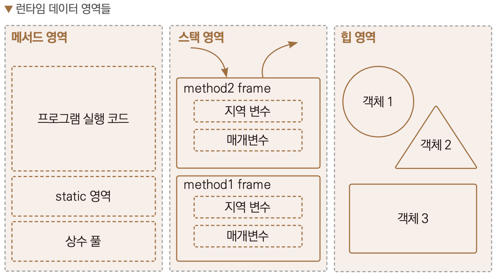

# JVM의 구조와 Java의 실행방식

## JVM ( Java Virtual Machine )
- JVM은 JRE의 일부로,  
JDK의 javac 유틸리티를 통해 자바 소스파일로 부터 변환된 Byte Code들을  
Runtime Data Area에 로드하여 자바 API와 함께 실행엔진을 통해 실행시키는 SW로 구현된 일종의 CPU이다.

- JVM은 크게 보면 Class Loader, Runtime Data Area, Execution Engine, Garbage Collector로 이루어져 있다.

- Class Loader는 실행 시에 모든 Java의 클래스를 로드하는 것이 아닌, Runtime에서 CPU가 필요로 하는 Class를 동적으로 로드한다.

### [ Class Loader ]
- Java Application Source로 부터
javac 컴파일러로 컴파일된 Byte 코드들 ( .class 파일들 )을
JVM의 Runtime Data Area에 로드하는 모듈이다.

- 1) Loading , 2) Linking, 3) Initialization
이 세단계를 거쳐서 Runtime Data Area에 올라가게 된다.

- 한번에 모든 클래스를 메모리에 올리지 않고,
어플리케이션에서 필요한 경우 동적으로 메모리에 적재한다. ( = 동적 클래스 로딩 )

- 2. Linking 단계에서, Verify / Prepare / Resolve 세 단계를 거친다.

[1] Loading
- 클래스 파일을 가져와서 JVM의 메모리에 로드한다.
- Runtime Data Area의 Method Area에 로드
- 메서드, 변수, 클래스, 인터페이스, 열거형을 구분하여 저장한다.

< Class Loader 의 종류 >
- BootStrap Class Loader : JVM 시작 시 가장 먼저 실행되는 클래스 로더
  - Java Class를 로드할 수 있는 자바 자체의 클래스 로더, java.io / java.net / java.util / java.lang 과 같은 기초가 되는 클래스를 로드함.

- Extension Class Loader
  - 확장 자바 클래스를 로드한다.
  - Bootstrap Class Loader를 부모로 가진다.
  - jre/lib/ext 디렉터리에 있는 클래스들을 로드

- Application Class Loader
  - ClassPath에 있는 클래스파일 또는 jar에 속한 클래스를 로드한다.
  - 개발자가 생성한 .class 확장자 파일을 로드한다.
  - System Class Loader라고도 한다.

[2] Linking
- 클래스 파일을 사용하기 위해 검증하는 과정이다.

2-1. Verify ( 검증 )
- 읽어들인 클래스 파일이 JVM 명세에 명시된 대로 구성되어 있는지 검사한다.
- 이 단계에서 실패 시, `java.lang.VerifyError` 발생

2-2. Prepare ( 준비 )
- 클래스가 필요로 하는 메모리 할당.
- 메모리 할당, static field를 기본값으로 초기화 ( = 사용자가 지정한 값이 아니라 자료형의 기본값 )

2-3. Resolve ( 분석 )
- 클래스의 상수 풀 내에 모든 심볼릭 레퍼런스를 다이렉트 레퍼런스로 변경한다.
: 심볼릭 레퍼런스 -> 메모리의 주소가 아닌, 이름에 의한 참조
: 다이렉트 레퍼런스 -> 메모리의 주소에 의한 참조

3. Initialization ( 초기화 )
- 클래스 변수들을 적절한 값으로 초기화한다. ( ex. static 필드들을 설정된 값으로 초기화 )

< 각 클래스 로더의 동작 과정 >
1. Method Area에 클래스가 로드 되어있는지 확인
2. 없다면 시스템 클래스 로더 ( Application Class Loader 에 클래스 로드 요청
3. 시스템 클래스로더 -> 확장 클래스 로더 -> 부트스트랩 클래스 로더로 위임함.
4. 위에서부터 차례대로 클래스 존재 확인.
5. 전부 없다면 `ClassNotFoundException` 발생.

### [ Runtime Data Area ]

- Runtime Data Area의 데이터 영역을 크게 나누는 기준은
해당 메모리 영역들이 JVM의 Thread 들에 공유되는지, 아닌지를 기준으로 볼 수 있다.
 
< Java Application 실행 시 각 Thread 에게 공유되는 영역 >
- Method 영역
: 프로그램 실행 코드, 생성자 코드, static 메서드, 상수 리터럴 값들이 속한 영역이다.

- Heap 영역
: 런타임에 생성된 객체들 자체가 저장된 영역이다.
: Eden, Survivor, Old 영역으로 나눌 수 있다. ( Java 7 이전에는 PermGen 영역도 포함 )

< Java Application 실행 시 각 Thread 별로 독립적으로 존재하는 영역 >
- Stack 영역
: 각 쓰레드별로 메서드를 실행할 때, 해당 메서드의 실행을 위한 로컬 변수의 할당, 연산을 위한 영역이다.
: Frame이라는 자료구조 형태로 LIFO 형식으로 저장된다.

- PC Register
: 연산의 주소 값을 저장하는 방식을 취하고 있다.
: 자바의 메소드를 수행하고 있다면, JVM의 명령(Instruction) 주소를 PC Register에 저장함.
: Native Method를 수행하고 있다면, Undefined 상태가 됨.
: Natvie Method를 수행하기 위한 메모리 영역으로 Native Method Stack을 사용함.

- Native Method Stack
: JNI를 통해 실행된 Native Method들이 사용하는 Stack

### [ Execution Engine ]

- Interpreter
: Runtime Data Area의 Method 영역에 있는,
-자바 바이트 코드를 한줄씩 실행하며, 기계어로 바꿔줌.

- JIT Compiler
: JVM이 해당 코드가 일정 수준 이상으로 반복되는 코드라는 것을 발견하면,
JIT Compiler를 통해 동적으로 해당 코드를 기계어 코드로 컴파일 한 뒤에, 해당 명령어를 메모리에 캐시해둠.
: 성능 최적화

- Garbage Collector
: 실행 중 Heap 메모리의 할당, 회수를 GC를 통해 자동화해줌.

### [ Garbage Collector ]
- Java Application 실행 중, 참조되지 않은 ( Unreachable한 객체들 ) 인스턴스들을 지워서
메모리를 자동 관리해주는 기능

- GC가 일어나는 Heap 메모리 영역에 따라 Minor GC, Major GC로 나뉘고
Major GC 때 STW 문제로 인해 어플리케이션이 멈추는데, 이는 애플리케이션 성능을 크게 좌우한다.

### [ JNI Interface ]

## Java
- JVM 기반에서 작동하는 OOP언어
- C/C++의 가장 큰 특징인 메모리 관리와 책임이슈를 구조적으로 제거하였다.
- Platform ( CPU + OS )에 대한 의존성이 없다.
- 하이브리드 방식 ( 컴파일러, 인터프리터 ) 특징을 모두 가진다.

## JVM ( Java Virtual Machine )의 구조
- GC를 통해 할당된 메모리를 관리해준다.

## JVM ( Java Virtual Machine ) 개요
- JVM은 자바 플랫폼의 초석이다.

- Java 애플리케이션은 자바 가상 머신 위에서 실행되며,
그렇기에 Java의 동작 방식을 이해하기 위해서는 JVM에 대한 이해가 선행되어야 한다.

## JDK, JRE, JVM

- JDK는 JRE를 포함하고, JRE는 JVM을 포함한다.

- JDK = JRE + 개발 관련 도구( javac, javap, javadoc, java, jar )

- JRE = JVM + ( Class Libs / File for supporting execution of program )

- JVM = Class Loader + Runtime Data Area(Method, Heap, PC Register, Stack, Native Method Stack )  + Execution Engine( Interpreter / JIT Compiler / Garbage Collector ) + JNI Interface + JNI Library

JDK
- javac : 자바 언어를 바이트 코드로 컴파일 해주는 자바 컴파일러(javac)

- javap : 자바 클래스 파일을 해석해주는 역 어셈블리어

- jar : 자바로 개발한 여러 클래스 파일과 패키지 파일을 jar 파일로 압축하여 참조하거나, 다움받을 때 사용한다.
  ( 터미널에서 jar 명령어를 사용하여 jar 파일을 생성할 수 있다. )

- javadoc : 자바 클래스의 문서화 작업을 위한 명령어

- java : javac을 통해 컴파일된 클래스 파일 ( 바이트 코드 )을 실행한다. ( java testClass)

JRE

- JRE는 자바 실행 환경으로
JVM 및 자바 클래스 라이브러리, 기타 자바 어플리케이션 실행에 필요한 파일을 포함한다.

JVM  

- JVM은 자바 가상 머신으로,
자바 어플리케이션을 실행하는 가상 머신이다.
실제 컴퓨터로부터 Java 어플리케이션 실행을 위한 메모리를 할당받아
Runtime Data Area를 구성하고, 실행 엔진을 통해 바이트 코드를 기계어로 바꿔준다.

- JVM은 인터프리터 / JIT 컴파일러를 통해 바이트 코드를 각 운영체제에 맞는 기계어로 해석시켜 실행시킨다.
또한, GC를 통해 어플리케이션의 Heap 메모리를 관리한다.

---
## JVM 명세 ( The Java Virtual Machine Specification )

- JVM이 제공해야하는 기능을 묶어놓은 인터페이스와 같음

- 해당 인터페이스를 따르면, 누구나 JVM을 개발하여 제공할 수 있다.

- JVM 종류 : 오라클의 핫스팟 JVM, IBM JVM ..

## JVM 구조

### Runtime Data Area

- 프로그램 실행 중 다양한 런타임 데이터 영역을 사용한다.

- 런타임 데이터 영역은, 모든 스레드들이 공유하는 영역과
스레드 별 할당되는 영역으로 구분된다.

- 런타임 데이터 영역은
Heap / Method / 그 외 영역으로 구분된다.

- JVM을 시작하면, Heap영역과 Method 영역이 생성되며
해당 영역들은 모든 스레드들이 공유한다.

- 각 스레드가 시작될 때마다,
스레드 마다 PC Register, Stack, Native Method Stack이 생성되고
스레드가 종료될 때 사라진다.

- 모든 스레드들이 실행되고 종료되면, JVM이 종료되면서
Heap 영역과 Method 영역도 사라진다.

---
< PermGen vs MetaSpace >
PermGen (Java 7 이전):

위치: Heap 영역 안에 속함.
목적: 클래스 메타데이터와 클래스 인스턴스를 저장.
문제: 클래스 로딩이 많아지면서 PermGen 공간이 부족할 수 있었고, 이로 인한 OutOfMemoryError가 발생하기도 했습니다.
크기 조절: -XX:MaxPermSize와 같은 옵션을 통해 PermGen 크기를 조절할 수 있었습니다.
Metaspace (Java 8 이후):

위치: Heap이 아닌 Native 메모리 영역에 위치함.
목적: 클래스 메타데이터를 저장. PermGen과는 달리, 동적으로 크기가 조절됨.
문제 해결: Metaspace는 Heap 외부에 위치하므로 Heap 관련 문제가 발생하지 않음.
크기 조절: -XX:MaxMetaspaceSize와 같은 옵션을 통해 Metaspace 크기를 제한할 수 있음.
차이점:

위치: PermGen은 Heap 내에 위치했지만, Metaspace는 Native 메모리에 위치함.
크기 조절: PermGen은 고정 크기였지만, Metaspace는 동적으로 조절 가능.
OutOfMemoryError: PermGen은 클래스 메타데이터 공간이 부족할 경우 발생했지만, Metaspace는 Native 메모리를 사용하므로 다른 종류의 메모리 오류가 발생할 수 있음.

< MetaSpace vs Method Area >
