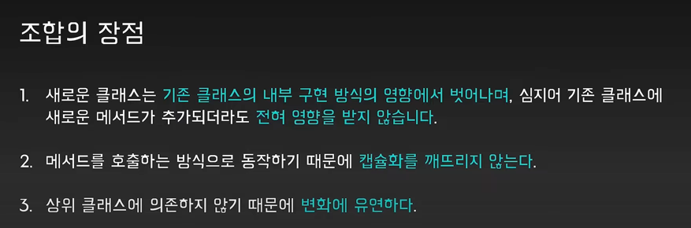
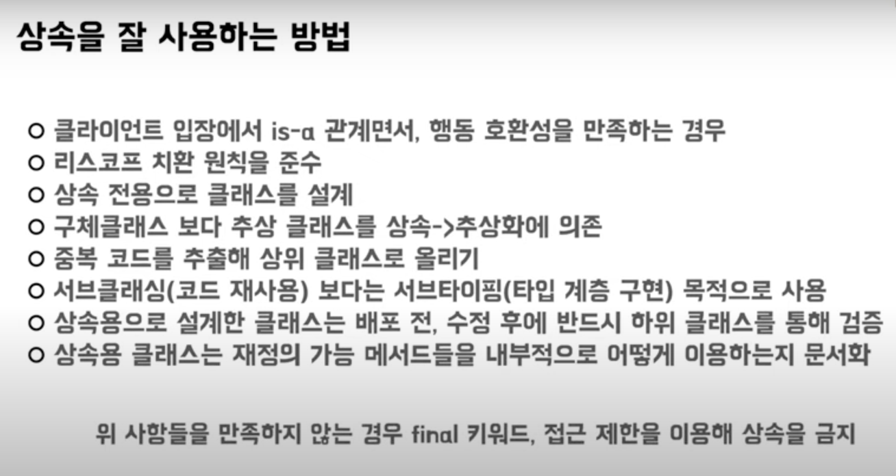

### 인터페이스와 추상클래스의 차이점을 알려주세요.

나의 답변

```text
여러 가지 차이가 있지만,
핵심은 사용 용도의 차이에 있습니다.
추상 클래스는 클래스 간의 연관 관계를 구축하기 위한 목적이 있지만,
인터페이스는 이를 구현하는 객체가 같은 동작을 한다는 것을 보장하기 위한 용도로 사용합니다.
이 외의 차이로는,
인터페이스는 다중 상속을 지원하고, 추상클래스는 단일 상속을 지원하며
둘의 선언 시 키워드가 다르고, ( interface vs abstract )
구현 클래스에서의 상속 시 키워드 또한 다르다는 것이 있습니다.
이 밖의 몇가지 차이가 있지만, 중요한 차이는 사용 용도의 차이라 할 수 있습니다.
( 추상 클래스는 멤버 변수가 있지만, 인터페이스는 멤버 변수가 없고 오직 상수만 존재한다. )
```

꼬리질문
- `상속(Inheritance) 과 조합(Composition)은 왜 사용하나요?`<br>
  `둘의 차이는 무엇인가요, 각각 언제 사용하나요?`

```text
상속과 조합은 객체지향 프로그래밍에서 객체 간의 관계를 나타내는 데에 쓰입니다.

상속을 통해 기존의 코드를 재사용하기 쉬워지고, 부모-자식 관계를 명확히 함으로써 객체 간 관계가 명확해지는 장점이 있지만
부모 클래스의 상태와 기능을 자식 클래스가 직접적으로 의존하고, 클래스 간의 결합도 가 높아지는 단점이 있습니다.
부모 클래스가 수정되면, 자식 클래스에도 영향을 미치게 됩니다.
이렇게 서브 클래싱 목적의 상속이 다계층으로 이루어진 경우, 변경의 전파범위가 매우 크고 유지보수가 어려워집니다.
그리고, 자식 클래스가 부모 클래스의 구현에 직접 접근할 수 있기에,
특정 클래스의 구체적인 구현을 몰라도 사용만 하면 된다는 캡슐화의 이점이 사라집니다.
또한 클래스의 계층 구조가 복잡해질수록 코드의 이해와 디버깅이 어려워집니다.

조합은, 기존에 만들어진 클래스를 새로운 클래스의 구성요소로 사용하는 것입니다.
클래스 내에서 다른 클래스의 인스턴스가 제공하는 API에만 의존하기에, 클래스 간의 결합도를 낮출 수 있습니다.
즉, 포함 객체의 구현이 바뀌어도 클라이언트 객체가 영향받지 않습니다.
다른 클래스의 인스턴스를 포함하고 이 객체의 기능을 호출하여 사용하기에, 캡슐화가 유지되고 클래스 간의 관계를 동적으로 변경할 수 있습니다.
이 때 내부 객체를 호출하는 것을 Forwarding, 즉 전달이라고 합니다.
하지만, 코드의 일관성을 유지하기 어렵습니다. ( ISP와 연결해서 설명할 수 있을 듯 ? )
```




상속의 목적 중 서브 클래싱 vs 서브 타이핑 <br>
=> 서브 클래싱으로 사용하는 것보단 상속을 통한 서브 타이핑을 통한 타입 계층을 구축하는 다형성으로 활용

상속은 타입 계층을 구성하는데 활용하고,
조합은 코드의 재사용을 위해 사용하면 좋을 것 같다.

```text
읽어볼만한 글

아.. 그리고 상속과 재사용에 대해 정말 잘못 알려진 것 중에 하나..

상속을 통해 재사용성이 좋아진다는 것은 상속받은 자식 클래스가 부모 클래스의 멤버함수를 쓸수 있기 때문에 코드를 재사용할수 있는 것이다??
그럼 그냥 애초에 멤버함수로 만들지 말고 그냥 전역 함수로 만들면 되잖아요?
그럼 어떤 곳에서도 그 함수를 쓸수 있는데 뭣하러 멤버함수로 만들어 상속을 받아야만 재사용될수 있도록 사용을 제한했나요?
이런 논리라면 오히려 클래스와 상속이란 것이 재사용성을 막는 것이지 않나요???

이건 애초에 OOP에 대해 잘못 이해하신 분들이 책과 유튜브를 통해서 잘못 전파시킨 가장 큰 오류 중에 하나죠.
클래스와 상속의 재사용 성이란 것은 자식 클래스가 부도클래스의 함수를 다시 쓸수 있다는 것이 아닙니다.

클래스와 상속의 재사용성이란 클래스 내의 코드를 제사용한다는 것이 아니라 클래스를 사용한 외부의 코드를 재사용할수 있다는 의미죠.
타입계층? 뭐 이것 때문에 상속을 쓴다고 한 이것이 OOP가 코드를 재사용성하는 근본 원리입니다.
OOP란 것 자체가 동작을 공통화할수 있는 것을 묶어서 interface class를 정의해서(이것을 추상화라고 하죠.)
그걸 기반으로 코드를 작성하게 되면... (이 과정에서 encapsulation과 information hiding이 가능하죠.)
interface class를 상속받아 구현한 모든 클래스는 그 코드를 재사용할 수 있다는 개념이죠.
이걸 기반으로 또 design pattern이란 보다 큰 추상화 개념들이 등장합니다.

엄격한 의미에서 JAVA는 제대로된 OOP언어는 아닙니다. C++도 마찬가지구요. 하지만 C++이 JAVA보다는 좀더 OOP에 더 가깝죠.
완전한 OOP을 구현하려면 아무래도 성능의 문제도 있고 오히려 오류를 더 많이 만들어 낼수 있기 때문에... interface class를 정의해서 OOP에 접근하는 c++에서 제안했던 방법을 거의 모든 OOP언에서 채용하고 있죠.

JAVA 개발자들이 OOP를 제대로 이해한 분들이 많이 없는 이유가 아무래도 다중상속과 같은 개념들을 앗사리 넘어가 버린다는 것빈다.
다중상속이 꼭 있어야 OOP다 라는 것이 아니라 다중상속을 배우고 쓰는 과정에서 아~~ OOP란 것이 이런 것이구나 하는 중요한 개념들을 알게 되는 경우가 많기 때문이죠. 
JAVA의 교육과정을 여러 곳을 봤지만 대부분 OOP에 대해서는 좀.... 부족한 면이 있더군요.
어떤 유명한분의 강의에선.. OOP가 마치 절차적 프로그래밍이 아닌 것 처럼 마치 대척점에 있는 프로그램 개념인 것처럼 말씀을 하시기도 하더군요.

```

- `자바는 다중상속을 지원하지 않는데, 그 이유가 무엇인가요?`
```text
< The Diamond Problem >

< 다중상속 허용 시, 클래스의 성질이 복합적으로 섞여 부모와 Is-A 관계가 모호해짐 >

참고할만한 사이트
https://castlejune.tistory.com/30#:~:text=%EB%98%90%ED%95%9C%20%EB%8B%A4%EC%A4%91%EC%83%81%EC%86%8D%EC%9D%84%20%ED%97%88%EC%9A%A9,%EC%83%81%EC%86%8D%EC%9D%84%20%EC%A7%80%EC%9B%90%ED%95%98%EC%A7%80%20%EC%95%8A%EC%8A%B5%EB%8B%88%EB%8B%A4.
```

- `마커 인터페이스에 대해 알고 있나요? 그 예시가 있을까요?`

```text
자바의 마커 인터페이스는, 일반적인 인터페이스와 동일하지만
사실상 아무 메소드도 선언하지 않은 인터페이스를 말합니다.
자바에서 어떤 객체가 직렬화 가능하다는 것을 나타내는 데에
Serializable 이라는 인터페이스를 implements 합니다.
또한, 어떤 오브젝트가 Clone 가능하다는 것을, implements Cloneable이라 표시하고,
스프링에서 Event Listener 를 사용하면, EventListener 라는 인터페이스도 사용합니다.
대부분 instanceof 연산자와 함께, 단순한 타입 체크의 기능을 한다 할 수 있습니다.
```

- `마커 인터페이스와 마커 어노테이션의 차이가 무엇인가요?`

-> 추후 작성 예정

### 추상 클래스와 인터페이스의 공통점
- 각자 내부적으로 추상 메소드가 한 개 이상 존재한다.
- 그렇기에, 인스턴스화 ( 실체화 시켜 Heap 메모리에 할당 )할 수 없다.
- 둘 다 상속받아 구현할 대상이 된다.

### 추상 클래스의 특징
-