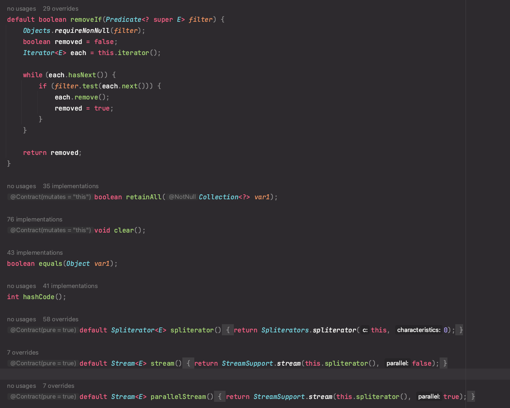

### Java 8에 추가된 기능에 대해서 설명해주세요.

```text
Java 8에 추가된 기능으로는
함수형 인터페이스 도입, Lambda 표현식, 메서드 참조, 
Optional 클래스 도입, 날짜 시간 API 수정, Stream API 도입,
인터페이스의 Static 및 Default 메서드 도입 등이 있습니다.
```

### [ 1. Lambda 표현식 ; Lambda Expressions ]
- 람다 표현식을 통해 함수형 프로그래밍 스타일로 코드를 구성할 수 있음.

- SAM Interface ( Single Abstract Method , 즉 함수형 인터페이스 )를
직관적이고 빠르게 구현할 수 있는 표현식

- 컬렉션 프레임워크를 Stream화 시켜서 조작할 때, 매우 편리하게 사용 가능함.

- 람다 표현식의 목적 : 1) Functional Interface의 구현을 제공한다. 2) 코드의 수를 줄인다.

- 람다 표현식은 '함수'와 마찬가지로 다루어진다, 그렇기에 컴파일러가 .class file을 만들지 않음.
  ( 이전에 Functional Interface 구현 시, 익명 클래스를 정의해주어야 헀음. -> .class 파일 생성 )

#### [ Comparator 인터페이스와 람다 표현식 ]
```java
import java.util.ArrayList;  
import java.util.Collections;  
import java.util.List;  
class Product{  
    int id;  
    String name;  
    float price;  
    public Product(int id, String name, float price) {  
        super();  
        this.id = id;  
        this.name = name;  
        this.price = price;  
    }  
}  
public class LambdaExpressionExample10{  
    public static void main(String[] args) {  
        List<Product> list=new ArrayList<Product>();  
          
        //Adding Products  
        list.add(new Product(1,"HP Laptop",25000f));  
        list.add(new Product(3,"Keyboard",300f));  
        list.add(new Product(2,"Dell Mouse",150f));  
          
        System.out.println("Sorting on the basis of name...");  
  
        // implementing lambda expression  
        Collections.sort(list,(p1,p2)->{  
            return p1.name.compareTo(p2.name);  
        });  
        for(Product p:list){  
            System.out.println(p.id+" "+p.name+" "+p.price);  
        }
    }  
}  
```

결과
```text
Sorting on the basis of name...
2 Dell Mouse 150.0
1 HP Laptop 25000.0
3 Keyboard 300.0
```

### [ 2. 함수형 인터페이스 ; Functional Interface = Single Abstract Method Interface ]
- 추상 메서드를 단 하나만 가지고 있는 인터페이스

- 람다 표현식을 통해 익명으로 구현할 수 있음.

- 내부에 default 메서드나 static 메서드는 몇개든 가지고 있을 수 있음.

#### [ java.util.function 패키지에 미리 정의되어 있는 함수형 인터페이스 종류 ]


### [ 3. 메서드 참조 ; Method Reference ]
- 함수형 인터페이스의 추상 메서드를 참조하기 위해 사용됨.
- 람다 표현식의 더욱 간결한 표현
- 람다 표현식을 단순히 메서드를 참조하기 위해서만 사용한다면, 메서드 참조 표현으로 바꿀 수 있음.

#### Ex-1 ) Functional Inferface의 메소드에 static method 참조
```java
@FunctionalInterface
interface Sayable{  
    void say();  
}  
public class MethodReference {  
    public static void saySomething(){  
        System.out.println("Hello, this is static method.");  
    }  
    public static void main(String[] args) {  
        // Referring static method  
        Sayable sayable = MethodReference::saySomething;  
        // Calling interface method  
        sayable.say();  
    }  
}  
```

결과
```text
Hello, this is static method.
```

#### Ex-2 ) Runnable I/F에 임의의 메서드 참조 ( Runnable I/F은 함수형 I/F로 내부적으로 run() 메소드를 가짐 )

```java
public class MethodReference2 {  
    public static void ThreadStatus(){  
        System.out.println("Thread is running...");  
    }  
    public static void main(String[] args) {  
        Thread t2 = new Thread(MethodReference2::ThreadStatus);  
        t2.start();       
    }  
}
```
결과
```text
Thread is running...
```

### Ex - 3, 4 ) 함수형 인터페이스 중 BiFunction에 대한 메서드 참조 예시

```java
import java.util.function.BiFunction;

class Arithmetic{
    public static int add(int a, int b){
        return a+b;
    }
}

public class MethodReference3 {
    public static void main(String[] args) {
        BiFunction<Integer, Integer, Integer> adder = Arithmetic::add;
        int result = adder.apply(10, 20);
        System.out.println(result);
    }
}  
```

```java
import java.util.function.BiFunction;
class Arithmetic{
    public static int add(int a, int b){
        return a+b;
    }
    public static float add(int a, float b){
        return a+b;
    }
    public static float add(float a, float b){
        return a+b;
    }
}
public class MethodReference4 {
    public static void main(String[] args) {
        BiFunction<Integer, Integer, Integer> adder1 = Arithmetic::add;
        BiFunction<Integer, Float, Float> adder2 = Arithmetic::add;
        BiFunction<Float, Float, Float> adder3 = Arithmetic::add;
        int result1 = adder1.apply(10, 20);
        float result2 = adder2.apply(10, 20.0f);
        float result3 = adder3.apply(10.0f, 20.0f);
        System.out.println(result1);
        System.out.println(result2);
        System.out.println(result3);
    }
}  
```

위와 같이 static 메서드를 참조할 때는, 객체 생성 없이 `클래스 이름::메서드 이름`으로 접근하면 된다.

인스턴스 메서드를 참조하는 예시는 Ex 1 ~ 4 에 대응되서 하나씩 만들 수 있지만
대표적인 것 하나만 찝고 넘어가보겠음.

```java
import java.util.function.BiFunction;  

class Arithmetic{  
    public int add(int a, int b){  
        return a+b;  
    }  
}  

public class InstanceMethodReference3 {  
    public static void main(String[] args) {  
        BiFunction<Integer, Integer, Integer> adder = new Arithmetic()::add;  
        int result = adder.apply(10, 20);  
        System.out.println(result);  
    }  
}  
```
new를 통해 인스턴스를 생성한 후에야 참조 가능하다는 것 명심!!

#### [ 생성자 참조 ]
`클래스 이름::new` 라는 키워드로 메서드 참조가 가능하다.

```java
interface Messageable{
    Message getMessage(String msg);
}

class Message{
    Message(String msg){
        System.out.print(msg);
    }
}

public class ConstructorReference {
    public static void main(String[] args) {
        Messageable hello = Message::new;
        hello.getMessage("Hello");
    }
}
```

### [ 4. Optional 클래스 도입 ]

- public final class Optional

- Unchecked Exception인 NullPointerException 을 잘 다루기 위한 클래스

- of, ofNullable, empty 와 같은 정적 팩토리 메서드 및 <br>
ifPresent, filter, map, flatMap, orElseGet, orElseThrow와 같은 함수형 인터페이스를 매개변수로 받는<br>
메서드 또한 구현해놓음.


### [ 5. 인터페이스의 static method / default method 도입 ]

- 인터페이스에 추상 메서드만을 두는 것이 아닌, default method / static method 또한 둘 수 있도록 함.

- Default Method는 Body를 가질 수 있음. 인터페이스는 제공하고자 하는 기본 구현을 제공하고, 이를 상속한 클래스나 인터페이스에서 재정의 가능

ex) Collection 인터페이스의 default method인 `removeIf()`, `stream()`


-> 참고) 인터페이스는 기본적으로 Object 클래스의 자식이기에, equals()나 hashCode() 메서드를 선언할 수 있다.

- default method의 도입 이유는 기존에 이미 선언된 인터페이스의 확장에 대한 유연성을 주기 위함.

- 만약, 상위 인터페이스에 새로운 추상 메서드 선언 시, 모든 구현체에서 그를 구현해줘야하는 문제가 발생함.

- Static Method는 Utility Method를 제공하기 위한 용도

#### [ Abstract Class vs Java 8 Interface ]
- 인터페이스에 default, static 메서드가 추가됨에 따라,
'기본 구현'을 제공하고, '상속한 클래스에 대한 유틸리티 기능을 제공'할 수 있던 abstract class의 역할이 대체됨.

- Java8 인터페이스와 Abstract Class의 차이는 이제 생성자의 유무.

- 과연 Abstract Class는 필요한걸까?


### [ 6. forEach 문 ; forEach Statement In Iterable & Stream I/F ]
- Iterable Interface ( Collection 클래스가 구현하는 I/F )과 Stream 인터페이스에 선언되어있는 메서드

- Ex) Iterable 인터페이스의 default method인 forEach


- Ex) Stream 인터페이스에 선언되어 있는 forEach


### [ 7. 날짜, 시간 API ; Date/Time API ]

참고 : https://www.javatpoint.com/java-date

- 레거시인 `java.util.Date` 와 `java.util.Calendar` 클래스의 단점을 보완

#### [ 기존의 Date 와 Calanedar 클래스의 단점 ]
1) Thread-Safe 하지 않았음. -> 동시성 이슈로 인한 디버깅에 어려움을 줌.
- Java 8 이후 Date / Time 클래스는 불변임. 따라서 Thread-Safe 함. -> 개발자들에게 동시성 이슈를 신경쓰지 않게 해줌.

2) 잘못된 설계로 인한 다루기 어려운 이슈
-> 날짜와 시간을 세세하게 다루기 어려웠음.
-> 새로운 Date, Time Libs 에서는 세세한 단위로 다룰 수 있음.

3) 타임존을 다루기 어려웠음
-> 개발자가 직접 타임존을 다루기 위한 로직을 작성해야만 했음.
-> 새로운 Date, Time Libs에는 LocalDateTime, LocalTime 을 통해 라이브러리 단에서 타임존 이슈를 해결해 줌.

#### [ 새로운 Date/Time API 의 종류 및 장점 ]
1) java.time.LocalDate
- "Year-Month-Day" 형식으로 날짜를 잘 나타내줌.
- 시간을 제외하고 날짜만을 잘 표현할 수 있음. ( 레거시에서는 불가능했음 )

2) java.time.LocalTime
- 시간만을 표현할 수 있음.

3) java.time.LocalDateTime
- 날짜와 시간을 둘 다 표현해줌.

4) java.time.ZonedDateTime
- LocalDateTime 클래스를 타임존 정보와 합침 ( ZoneId Class )
- 타임 존에 맞는 날짜와 시간을 표현해 줌.

5) java.time.OffsetTime
- 그리니치를 기준으로 주어진 오프셋만큼 떨어진 지역의 시간을 표시해줌. Time Zone ID를 사용하지 않음.

6) java.time.OffsetDateTime
- 그리니치를 기준으로 주어진 오프셋만큼 떨어진 지역의 날짜와 시간을 표시해줌. Time Zone ID를 사용하지 않음.

7) java.time.Clock
- 현재 Instant, 임의의 주어진 타임존의 날짜와 시간에 접근할 수 있음.

- 다른 타임존에 대해 코드 실행을 테스트하거나, 고정된 시간으로 태스트할 수 있음.

8) java.time.Instant
- Timestamp 찍기 좋음. ( EPOCH 기준으로 nanosecond 단위로 시간을 나타내줌, like System.currentMills() )

9) java.time.Duration
- 두 인스턴스 사이의 시간 차 ( seconds, nanoseconds 단위 )

10) java.time.Period
- 두 인스턴스 사이의 날짜 차 ( date-based values (years, months, days) 기준 )

11) java.time.ZoneId
- 타임존 식별자 ( Instant와 LocalDateTime 간의 변환에 대한 규칙 지정 )

12) java.time.ZoneOffset
- 그리니치 기준으로 타임존 오프셋을 나타냄

13) `java.time.format.DateTimeFormatter`
- 기존 레거시의 formatter의 문제를 해결
- parse() 또는 format() 메서드를 통해 날짜/시간 값들을 파싱하거나, 포맷팅할 수 있음.


### [ 8. Stream API 도입 ]

- `java.util.stream` 패키지는 컬렉션/배열 요소들에 대한 함수형 스타일의 연산을 지원하기 위한 클래스/인터페이스/Enum들을 모아놓은 패키ㅣㅈ

- 지연 연산을 사용하여, 해당 연산이 꼭 필요한 순간에만 연산을 진행함.

- 스트림의 연산의 파라미터로 SAM I/F 를 받는다, 따라서 해당 파라미터를 람다 표현식 or 메서드 참조로 나타낼 수 있음.

#### [ Stream의 기능 & 특징 ]
1) Stream은 데이터를 저장하지 않고, 해당 데이터들의 복사본을 가져옴. -> 원본을 변경시키지 않는다.

2) 지연 연산을 사용함

3) 스트림은 일회용임, 사용한 스트림 요소를 다시 접근하기 위해서는 새로운 스트림을 생성해야함.

4) 스트림 생성 - 중간 연산 #1 - 중간 연산 #2 - 중간 연산...#n - 최종 연산 1회 로 진행됨.

### [ 9. StringJoiner 클래스 도입 ]

- java.util 클래스 내에 새로 도입된 final class

- 주어진 delimiter로 구분지어진 문자열을 만드는 역할을 가진 클래스

- 생성자가 두가지 종류

`public StringJoiner(CharSequence delimiter);`
`public StringJoiner(CharSequence delimiter, CharSequence prefix, CharSequence suffix);`


Ex-1) 기본적인 사용 ( 생성자에 delimiter만 전달 )
```java
import java.util.StringJoiner;  
public class StringJoinerExample {  
    public static void main(String[] args) {  
        StringJoiner joinNames = new StringJoiner(","); // passing comma(,) as delimiter   
          
        // Adding values to StringJoiner  
        joinNames.add("Rahul");  
        joinNames.add("Raju");  
        joinNames.add("Peter");  
        joinNames.add("Raheem");  
                  
        System.out.println(joinNames);  
    }  
}  
```

```text
Rahul,Raju,Peter,Raheem
```

Ex-2) 기본적인 사용 ( 생성자에 delimiter / prefix / suffix 전달 )

```java
import java.util.StringJoiner;  
public class StringJoinerExample {  
    public static void main(String[] args) {  
        StringJoiner joinNames = new StringJoiner(",", "[", "]");   // passing comma(,) and square-brackets as delimiter   
          
        // Adding values to StringJoiner  
        joinNames.add("Rahul");  
        joinNames.add("Raju");  
        joinNames.add("Peter");  
        joinNames.add("Raheem");  
                  
        System.out.println(joinNames);  
    }  
}  
```

```text
[Rahul,Raju,Peter,Raheem]
```

Ex-3) StringJoiner의 merge() 메서드
```java
import java.util.StringJoiner;
public class StringJoinerExample {
  public static void main(String[] args) {

    StringJoiner joinNames = new StringJoiner(",", "[", "]");   // passing comma(,) and square-brackets as delimiter   

    // Adding values to StringJoiner  
    joinNames.add("Rahul");
    joinNames.add("Raju");

    // Creating StringJoiner with :(colon) delimiter  
    StringJoiner joinNames2 = new StringJoiner(":", "[", "]");  // passing colon(:) and square-brackets as delimiter   

    // Adding values to StringJoiner  
    joinNames2.add("Peter");
    joinNames2.add("Raheem");

    // Merging two StringJoiner  
    StringJoiner merge = joinNames.merge(joinNames2);
    System.out.println(merge);
  }
}  
```

```text
[Rahul,Raju,Peter:Raheem]
```

Ex-4) StringJoiner의 merge() 메서드 모음 ( setEmptyValue 포함 )
```java
import java.util.StringJoiner;
public class StringJoinerExample {
  public static void main(String[] args) {
    StringJoiner joinNames = new StringJoiner(","); // passing comma(,) as delimiter   

    // Prints nothing because it is empty  
    System.out.println(joinNames);

    // We can set default empty value.  
    joinNames.setEmptyValue("It is empty");
    System.out.println(joinNames);


    // Adding values to StringJoiner  
    joinNames.add("Rahul");
    joinNames.add("Raju");
    System.out.println(joinNames);

    // Returns length of StringJoiner  
    int length = joinNames.length();
    System.out.println("Length: "+length);

    // Returns StringJoiner as String type   
    String str = joinNames.toString();
    System.out.println(str);

    // Now, we can apply String methods on it  
    char ch = str.charAt(3);
    System.out.println("Character at index 3: "+ch);

    // Adding one more element   
    joinNames.add("Sorabh");
    System.out.println(joinNames);

    // Returns length  
    int newLength = joinNames.length();
    System.out.println("New Length: "+newLength);
  }
}  
```

```text
It is empty
Rahul,Raju
Length: 10
Rahul,Raju
Character at index 3: u
Rahul,Raju,Sorabh
New Length: 17
```


### [ 10. Collectors 클래스 도입 ]
-  ` Collectors is a final class that extends Object class. It provides reduction operations, such as accumulating elements into collections, 
summarizing elements according to various criteria, etc.`

- Stream의 최종 연산 시, 컬렉션으로 묶거나, 특정 기준으로 데이터를 집약하는 연산을 해주는 역할의 클래스

Ex-1) Collectors를 활용한 리스트의 합 계산 / 사실 Stream의 sum() 써도 됨.

```java
// ...
import java.util.stream.Collectors;
import java.util.List;
import java.util.ArrayList;
class Product{
  int id;
  String name;
  float price;

  public Product(int id, String name, float price) {
    this.id = id;
    this.name = name;
    this.price = price;
  }
}
public class CollectorsExample {
  public static void main(String[] args) {
    List<Product> productsList = new ArrayList<>();
    //Adding Products  
    productsList.add(new Product(1,"HP Laptop",25000f));
    productsList.add(new Product(2,"Dell Laptop",30000f));
    productsList.add(new Product(3,"Lenevo Laptop",28000f));
    productsList.add(new Product(4,"Sony Laptop",28000f));
    productsList.add(new Product(5,"Apple Laptop",90000f));
    Double sumPrices =
            productsList.stream()
                    .collect(Collectors.summingDouble(x->x.price));  // collecting as list  
    System.out.println("Sum of prices: "+sumPrices);
    Integer sumId =
            productsList.stream().collect(Collectors.summingInt(x->x.id));
    System.out.println("Sum of id's: "+sumId);
  }
}  
```

Ex-2) Collectors를 활용한 리스트 내부 값의 평균 계산
```java
import java.util.stream.Collectors;  
import java.util.List;  
import java.util.ArrayList;  
class Product{  
    int id;  
    String name;  
    float price;  
      
    public Product(int id, String name, float price) {  
        this.id = id;  
        this.name = name;  
        this.price = price;  
    }  
}  
public class CollectorsExample {  
    public static void main(String[] args) {  
        List<Product> productsList = new ArrayList<>();  
        //Adding Products  
        productsList.add(new Product(1,"HP Laptop",25000f));  
        productsList.add(new Product(2,"Dell Laptop",30000f));  
        productsList.add(new Product(3,"Lenevo Laptop",28000f));  
        productsList.add(new Product(4,"Sony Laptop",28000f));  
        productsList.add(new Product(5,"Apple Laptop",90000f));  
        Double average = productsList.stream()  
                         .collect(Collectors.averagingDouble(p->p.price));  
        System.out.println("Average price is: "+average);  
    }  
}
```

참고한 레퍼런스
- [JavaTpoint-Java-8-Features](https://www.javatpoint.com/java-8-features)