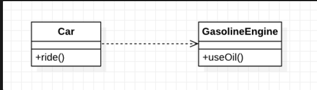
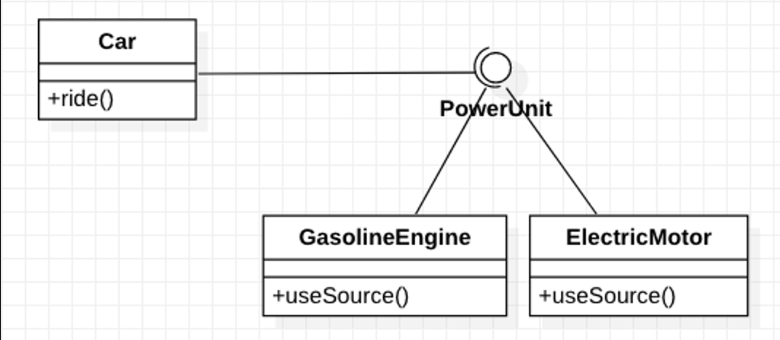

### [ Java Study - 강한 결합, 느슨한 결합 ]

- 어떤 모듈이 다른 모듈의 너무 자세한 부분(구현 세부사항)까지 알고 있을 경우, 강한 결합도를 가진다고 한다.
  어떤 모듈이 다른 모듈에 대해 필요한 정보(인터페이스로 추상화된 고수준 정책)만 알고 있다면, 두 모듈은 낮은 결합도를 가진다고 한다.

### 조영호 님의 ‘Object’ 책 내용 참조

### 강한 결합 ( Tight Coupling )

- 클라이언트 클래스가
  **구현 클래스(Concrete Class)**를 직접 참조하는 것이다,

### <강한 결합 예시 - Car 클래스와 GasolineEngine 클래스>



```java
public class Car [
		private GasolineEngine gasolineEngine = new GasolineEngine();

		public void ride() {
				gasolineEngine.useOil();
				...
		}
}

public class GasolineEngine {
		public void useOil() {}		
}
```

- 기존에 Car 클래스는 동력원으로써 GasolineEngine을
  Has-A 관계 ( Composition )로 직접 참조하고 있었다.
- 요구사항이 변경되어,
  Car의 동력원으로써 ElectricMotor를 사용하는 상황을 가정하면,
  구현 코드는 다음과 같이 변하게 된다.

```java
public class Car {
		private ElectricMotor electricMotor = new ElectricMotor();

		public void ride() {
				electircMotor.useBattery();
				...
		}
}

public class ElectricMotor {
		public void useBattery() {}
}
```

### 강한 결합의 특징

- Car가 GasolineEngine을 직접 참조하고,
  이에 따라 Gasoline 전용으로만 동작 가능하다.
- **동력원이 변경되면, GasolineEngine 에서 ElectricMotor를 참조하고 있다고 클래스 참조를 변경해야하고 (1)**
- **그에 따라 동력원이 제시하는 메서드들의 기능을 파악한 뒤,
  그에 따른 재구현이 필요하다 (2)**
- 즉, **강한 결합은 클라이언트 코드에 많은 변경을 요구**한다.

---

### 강한 결합의 문제를 해결하는 방법?

- Car가 반드시 동력장치가 GasolineEngine인지, ElectricMotr인지 알 필요가 없다.
- 그저, ‘동력장치’ 역할을 하는 어떤 대상을 두고,
  이에 대해 원하는 기능을 호출하면 되지 않을까?
- I/F가 해당 역할을 해줄 수 있다.

### 느슨한 결합(Loose Coupling)

- 느슨한 결합이란, 클래스 간의 결합력을 약하게 만들었다는 뜻이다.
- 구현 클래스를 직접 참조하기 보다는, ‘추상화’에 의존한다. ( DIP )
- 구체 클래스 의존에서 인터페이스 의존으로 갈수록 Client가 알아야할 지식의 양이 줄어든다. → SW 개발 복잡도가 줄어든다.
- 의존성 종류
    - 구체 클래스 의존성(Concrete Class Dependency)
    - 추상 클래스 의존성(Abstract Class Dependency)
    - 인터페이스 의존성(Interface Dependency)



- PowerUnit 이라는 인터페이스에
  useSource() 라는 공통 기능을 추상화시켜놓고,
  이를 상속받는 구체 클래스들이 각각 구현을 하게 한다.
- 클라이언트인 Car 클래스는
  구체 클래스들의 세부 구현사항을 몰라도 된다.
  ’역할’과 ‘기능’에 대해서만 숙지하면 된다.

**PowerUnit I/F로 느슨한 결합을 구현했을 때,**

**요구사항 변경 시 클라이언트 코드의 변화**

```java
public interface PowerUnit {
		void useSource();
}
```

**변화 전**

```java
public class Car {
		private PowerUnit powerUnit = new GasolineEngine();
		
		public void ride() {
				powerUnit.useSource();
				...
		}
}

public class GasolineEngine implements PowerUnit {
		@Override
		public void useSource() {}
}
```

**변화 후**

```java
public class Car {
		private PowerUnit powerUnit = new ElectricMotor();

		public void ride() {
				powerUnit.useSource();
				...
		}
}
```

Car 클래스에서 변경될 코드는

powerUnit에 구체 클래스의 Instance를 주입하는 부분이다.

즉, Car 클래스는 PowerUnit으로 받는 객체가 GasolineEngine인지, ElectricMotor인지만 알면 되고, 각각 PowerUnit의 구현체이므로, 강제되는 useSource 메서드만 사용하면 된다.

느슨한 결합을 통해 Client 코드의 변경점을 크게 줄였지만,

Car 클래스는 여전히 구체 클래스가 어떤 객체인지는 알고 있어야 한다.

즉, 클라이언트 코드의 변화가 최소화된 것이지, 아예 없는건 아니다.

Car 클래스가 의존하는 클래스를

외부에서 주입해주는 의존성 주입(Dependency Injection; DI)를 통해
Car는 비로소 PowerUnit Instance 주입 부분마저 수정할 필요가 없어진다.