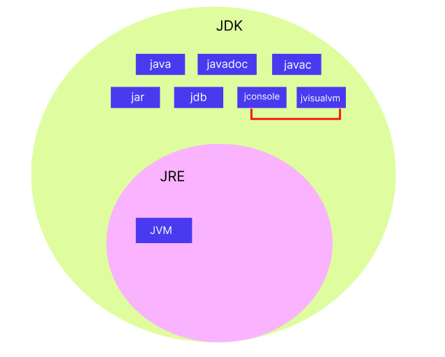

## JDK와 JRE의 차이점을 설명하세요.

---

### 1. JDK에 대해 설명하시오
- 자바 개발 키트, Java Development Kit
- 자바 프로그래밍 언어로 소프트웨어를 `개발`하기 위한 소프트웨어 개발 환경
- javac, JRE 및 각종 라이브러리 포함


### 2. JRE에 대해 설명하시오
- 자바 실행 환경, Java Runtime Environment
- 자바 프로그램을 `실행`할 수 있는 환경을 제공
- JDK의 일부
- 실행에 필요한 JVM, 라이브러리 및 클래스를 포함


🔼 JDK와 JRE의 관계

```
JDK는 JRE를 포함하고 있다.
```


### 3. 각 구성 요소들에 대해 알고 있는가
1. javac : 소스 코드에서 작성된 자바 프로그램을 바이트코드로 변환
2. javadoc : 소스 코드 내의 주석에서 문서를 자동으로 생성
3. jdb : 자바 디버거로, 코드 실행 중에 발생하는 문제를 진단하고 수정
4. jar : 여러 자바 클래스 파일과 관련 메타 데이터를 하나의 아카이브 파일(일반적으로 .jar 확장자를 가진다)로 묶는 도구
5. jconsole, jvisualvm 등의 모니터링 및 관리 도구: 애플리케이션 성능 모니터링, 시스템 리소스 사용 분석, 런타임 환경 최적화
6. JVM : 자바 가상 머신. 바이트코드를 실행시키는 런타임 환경


### 4. JDK와 JRE의 차이를 간단히 요약
- java 프로그램을 직접 개발하기 위해서는 JDK가 필요
- java 프로그램을 실행시키려면 JRE 필요
- JRE만으로는 프로그램 개발 불가
- JRE는 JDK에 포함된 요소이다