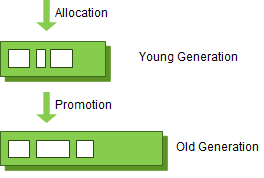

# JVM이란?
- JVM은 Java Virtual Machine의 약자로 자바 가상 머신의 이름을 줄여서 부르는 말이다.

    ✎ JVM는 스택기반의 가상머신이며, 메모리 관리를 담당한다.
## ✎ 스택 기반의 가상 머신
JVM은 OS와 Java의 중재자 역할을 진행한다. 

OS(Operator System)은 물리적 시스템과 소프트웨어적 시스템을 연결해주는 중간 다리 역할을 진행한다.
하지만 현재는 크게 3가지 OS가 존재하는데(Window, MacOS, Linux), 각각 동작하는 방식이 다 다르다.

따라서 같은 코드 구성이라도 Window에서 동작하는 코드와 MacOS에서 동작하는 코드가 다르게 동작하는 경우가 발생하여 코드를 유지, 보수, 개발하기가 힘들다. 
JVM은 위의 불편점을 해소하기 위해 OS위에 스택 기반의 가상 머신을 생성하여 동작하도록 구현되었다.

### 가상머신

가상 머신(VM : Virtual Machine)은 물리적인 CPU에 의해 처리되는 동작을 흉내낼 수 있어야 한다. 
따라서 일반적으로 VM은 아래의 개념들을 구현(포함)해야 한다.

- 소스 코드를 VM이 실행할 수 있는 바이트 코드로 변환
- 명령어와 피연산자를 포함하는 데이터구조
- 함수를 실행하기 위한 콜스택
- 다음 실행할 명령어를 가리키는 IP(Instruction Pointer)
- 가상 CPU
- Fetch
- IP가 가리키는 명령어를 가져온다
- Decode
- 가져온 명령어를 디코드(해석)한다.
- Execution
- 디코딩된 명령어를 수행한다

가상머신은 크게 2가지의 형태로 구분되는데, 레지스터 VM과 스택형 VM으로 구분된다.
JVM은 OS에 상관없이 구현되어야 하므로 Stack VM을 채택하여 사용하고 있다.

### Stack VM
예를 들어 13 + 20 + 7 을 계산한다고 하자. 
CPU의 덧셈 연산은 2개의 피연산자를 다루므로 20 + 7 를 계산한 결과를 13 과 더해야만 한다. 
스택 기반의 VM은 이 결과를 바로 스택에 저장한다.
따라서 20과 7을 더하기 위해서 두 피연산자를 스택에서 꺼낸다. 
꺼낸 결과를 가지고 계산한 뒤에 다시 결과를 스택에 넣어 계산하는 방식으로 동작하게 된다.

이처럼 스택 기반의 VM은 피연산자를 저장하고 가져올 때 스택을 활용한다. 
스택 기반의 VM의 장단점은 아래와 같다.

**✓ 장점**
- 하드웨어에 덜 의존적이다 
- 하드웨어(레지스터, CPU)에 대해 직접적으로 다루지 않으므로 다양한 하드웨어에서 쉽게 VM을 구현할 수 있다 
- 명령어의 길이가 짧아진다 
- 다음 피연산자는 스택의 TOP에 존재하므로 피연산자의 메모리 주소를 사용할 필요가 없다. 따라서 명령어에 메모리 주소를 적을 필요가 없으므로 명령어의 길이가 짧아진다

**✓ 단점**
- 명령어의 수가 많아진다 
- 스택을 사용하는 오버헤드가 존재한다 
- 명령어 최적화를 할 수 없다

### Register VM
예를 들어 13 + 20 + 7 을 계산한다고 하자. 
CPU의 덧셈 연산은 2개의 피연산자를 다루므로 20 + 7 를 계산한 결과를 13 과 더해야만 한다. 
레지스터 기반의 VM은 피연산자를 레지스터에서 가져와서 계산하고, 결과를 다시 레지스터에 저장한다.

이처럼 레지스터 기반의 VM은 피연산자를 레지스터에서 가져와서 계산한 뒤 다시 레지스터에 저장한다. 
레지스터 기반의 VM의 장단점은 다음과 같다.

**✓ 장점** 
- 명령어의 수가 적다 
- POP, PUSH 없이 하나의 명령어로 계산할 수 있으므로 명령어의 수가 적어진다 
- 스택을 사용하지 않아 스택에 대한 오버헤드가 없다 
- 스택 기반에서는 할 수 없는 명령어 최적화를 할 수 있다 
- 코드에 동일한 연산식이 존재하는 경우 처음 계산한 결과를 레지스터에 넣어서 여러번 쓸 수 있다. 따라서 식 계산에 들어가는 비용을 최적화할 수 있다

**✓ 단점**
- 명령어의 크기가 커진다 
- 명령어에 피연산자의 메모리 주소를 명시해야 하므로 명령어의 길이가 길어진다

## 메모리 관리
코드 파일을 실행하다 보면 일정 시간이 지난 후 사용되지 않는 객체들이 존재하게 된다. 
이런 객체들이 파일이 실행되는 동안 계속 남아있게 된다면, 메모리가 다 차서 코드가 진행이 안되는 OverFlow 에러가 발생하게 된다.

이렇게 메모리를 관리해야 하는데 C언어 같은 경우는 free()같은 명령어를 사용하여 직접 메모리를 해제해야 한다.
하지만 모든 객체를 직접 할당하고, 해제하게 된다면 개발자가 공부하고, 관리해야 하는 영역이 너무 커지게 된다.
따라서 객체 지향 언어들은 Garbage Collection(GC)를 도입하여 메모리를 관리하고 있다.

### Garbage Collection
JVM의 Heap영역은 처음 설계될 때 다음의 2가지를 전제로 설계되었다.

- 대부분의 객체는 금방 접근 불가능한 상태(Unreachable)가 된다.
- 오래된 객체에서 새로운 객체로의 참조는 아주 적게 존재한다.

즉, 객체는 대부분 일회성되며, 메모리에 오랫동안 남아있는 경우는 드물다는 것이다. 
그렇기 때문에 객체의 생존 기간에 따라 물리적인 Heap 영역을 나누게 되었고 Young, Old 총 2가지 영역으로 설계되었다.

- Young 영역(Young Generation)
  - 새롭게 생성된 객체가 할당(Allocation)되는 영역 
  - 대부분의 객체가 금방 Unreachable 상태가 되기 때문에, 많은 객체가 Young 영역에 생성되었다가 사라진다. 
  - Young 영역에 대한 가비지 컬렉션(Garbage Collection)을 Minor GC라고 부른다.
- Old 영역(Old Generation)
  - Young영역에서 Reachable 상태를 유지하여 살아남은 객체가 복사되는 영역 
  - Young 영역보다 크게 할당되며, 영역의 크기가 큰 만큼 가비지는 적게 발생한다. 
  - Old 영역에 대한 가비지 컬렉션(Garbage Collection)을 Major GC라고 부른다.

Old 영역이 Young 영역보다 크게 할당되는 이유는 Young 영역의 수명이 짧은 객체들은 큰 공간을 필요로 하지 않으며 큰 객체들은 Young 영역이 아니라 바로 Old 영역에 할당되기 때문이다.
예외적인 상황으로 Old 영역에 있는 객체가 Young 영역의 객체를 참조하는 경우도 존재할 것이다.

이러한 경우를 대비하여 Old 영역에는 512 bytes의 덩어리(Chunk)로 되어 있는 카드 테이블(Card Table)이 존재한다.
카드 테이블에는 Old 영역에 있는 객체가 Young 영역의 객체를 참조할 때 마다 그에 대한 정보가 표시된다. 

카드 테이블이 도입된 이유는 간단하다. 
Young 영역에서 가비지 컬렉션(Minor GC)가 실행될 때 모든 Old 영역에 존재하는 객체를 검사하여 참조되지 않는 Young 영역의 객체를 식별하는 것이 비효율적이기 때문이다. 
그렇기 때문에 Young 영역에서 가비지 컬렉션이 진행될 때 카드 테이블만 조회하여 GC의 대상인지 식별할 수 있도록 하고 있다.

### Minor GC
Young 영역은 1개의 Eden 영역과 2개의 Survivor 영역, 총 3가지로 나뉘어진다.

- Eden 영역: 새로 생성된 객체가 할당(Allocation)되는 영역
- Survivor 영역: 최소 1번의 GC 이상 살아남은 객체가 존재하는 영역

객체가 새롭게 생성되면 Eden 영역에 할당(Allocation)이 된다. 
그리고 Eden 영역이 꽉 차면 Minor GC가 발생하게 되는데, 사용되지 않는 메모리는 해제되고 Eden 영역에 존재하는 객체는 (사용중인) Survivor 영역으로 옮겨지게 된다. 
Survivor 영역은 총 2개이지만 반드시 1개의 영역에만 데이터가 존재해야 하는데, Young 영역의 동작 순서를 자세히 살펴보도록 하자.

1. 새로 생성된 객체가 Eden 영역에 할당된다.
2. 객체가 계속 생성되어 Eden 영역이 꽉차게 되고 Minor GC가 실행된다.
   1. Eden 영역에서 사용되지 않는 객체의 메모리가 해제된다.
   2. Eden 영역에서 살아남은 객체는 1개의 Survivor 영역으로 이동된다.
3. Eden 영역에서 사용되지 않는 객체의 메모리가 해제된다.
4. Eden 영역에서 살아남은 객체는 1개의 Survivor 영역으로 이동된다.

1~2번의 과정이 반복되다가 Survivor 영역이 가득 차게 되면 Survivor 영역의 살아남은 객체를 다른 Survivor 영역으로 이동시킨다.(1개의 Survivor 영역은 반드시 빈 상태가 된다.)
이러한 과정을 반복하여 계속해서 살아남은 객체는 Old 영역으로 이동(Promotion)된다.

객체의 생존 횟수를 카운트하기 위해 Minor GC에서 객체가 살아남은 횟수를 의미하는 age를 Object Header에 기록한다. 
그리고 Minor GC 때 Object Header에 기록된 age를 보고 Promotion 여부를 결정한다.
또한 Survivor 영역 중 1개는 반드시 사용이 되어야 한다. 
만약 두 Survivor 영역에 모두 데이터가 존재하거나, 모두 사용량이 0이라면 현재 시스템이 정상적인 상황이 아님을 파악할 수 있다.

### Major GC
Old 영역에 할당된 메모리가 허용치를 넘게 되면, Old 영역에 있는 모든 객체들을 검사하여 참조되지 않는 객체들을 한꺼번에 삭제하는 Major GC가 실행되게 된다. 

Young 영역은 일반적으로 Old 영역보다 크기가 작기 때문에 GC가 보통 0.5초에서 1초 사이에 끝난다.
하지만 Old 영역은 Young 영역보다 크며 Young 영역을 참조할 수도 있다. 
그렇기 때문에 Major GC는 일반적으로 Minor GC보다 시간이 오래걸리며, 10배 이상의 시간을 사용한다.

따라서 Major GC를 Full GC라고 부르기도 한다.

# ✎ 자바 프로그램의 실행 과정

1. 프로그램이 실행되면 JVM은 OS으로부터 이 프로그램이 필요로 하는 메모리를 할당받는다.
2. 자바 컴파일러(javac)가 자바 소스코드(.java)를 읽어들여 자바 바이트코드(.class)로 변환시킨다
3. Class Loader를 통해 class파일들을 JVM으로 이동시킨다.
4. 로딩된 class파일들은 Execution engine을 통해 해석된다
5. 해석된 바이트코드는 Runtime Data Areas에 배치되어 실질적인 수행이 이루어지게 된다.

# ✎ Runtime Data Area

- PC(Program Counter)
  - 현재 이 프로그램이 어떤 코드를 진행하는지에 대한 정보가 담겨있다.
- JVM Stack
  - 호출된 메서드의 파라미터, 지역변수, 리턴값이 저장되는 메모리 공간(정적으로 선언한 데이터가 저장되는 메모리 공간이다.)
  - 프로그램 실행 시 임시로 할당되었다가 메서드를 빠져나가게 되면 소멸되는 특성의 데이터들이 저장되는 영역
- Native Method Stacks
  - Java 이외의 언어에 제공되는 Method의 정보가 저장되는 공간 / Java Native Interface를 통해 바이트 코드로 저장 
  - Kernel이 자체적으로 Stack을 잡아 독자적으로 프로그램을 실행시키는 영역
- Heap
  - 객체를 동적으로 생성했을 때, 객체 인스턴스가 저장되어 있는 메모리 공간
  - 단, 레퍼런스 변수의 경우 Heap에 인스턴스가 저장되는 것이 아닌 포인터가 저장된다.
- Method Area
  - 클래스 정보를 처음 메모리에 올릴 때 초기화되는 대상을 저장하기 위한 영역
    **Field Information**
    - 멤버 변수에 대한 정보 (이름, 타입, 접근 지정자 등)
    
    **Method Information** 
    - 메서드에 대한 정보 (이름, 리턴 타입, 파라미터, 접근 지정자 등)

    **Type Information** 
    - Class 인지 Interface 인지 혹은 Type의 속성, 이름, super class의 이름 등 
    - 또한 Method Area에는 상수형을 저장하고 중복을 막는 Runtime Constant Pool이 존재

### 참고 자료
- https://www.korecmblog.com/blog/jvm-stack-and-register
- https://asfirstalways.tistory.com/158
- https://mangkyu.tistory.com/118
- https://inpa.tistory.com/entry/JAVA-%E2%98%95-%EA%B0%80%EB%B9%84%EC%A7%80-%EC%BB%AC%EB%A0%89%EC%85%98GC-%EB%8F%99%EC%9E%91-%EC%9B%90%EB%A6%AC-%EC%95%8C%EA%B3%A0%EB%A6%AC%EC%A6%98-%F0%9F%92%AF-%EC%B4%9D%EC%A0%95%EB%A6%AC#major_gc_%EA%B3%BC%EC%A0%95
